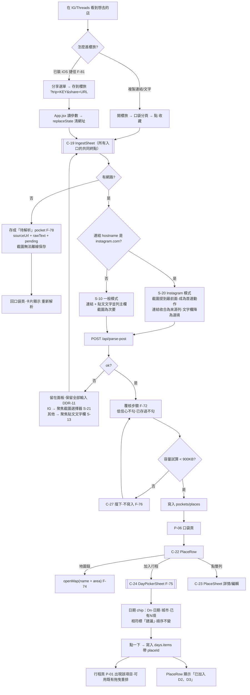
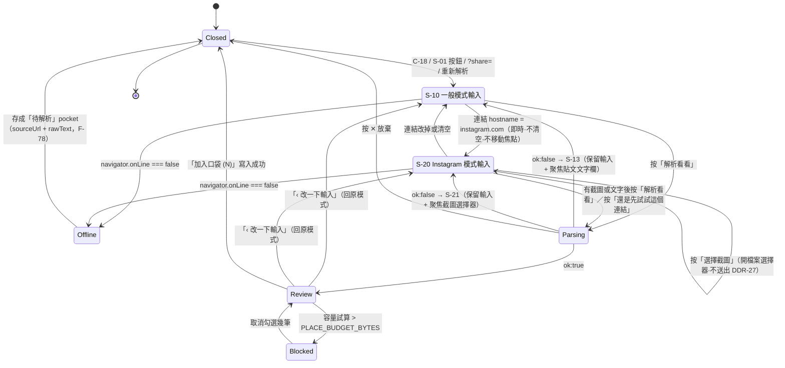
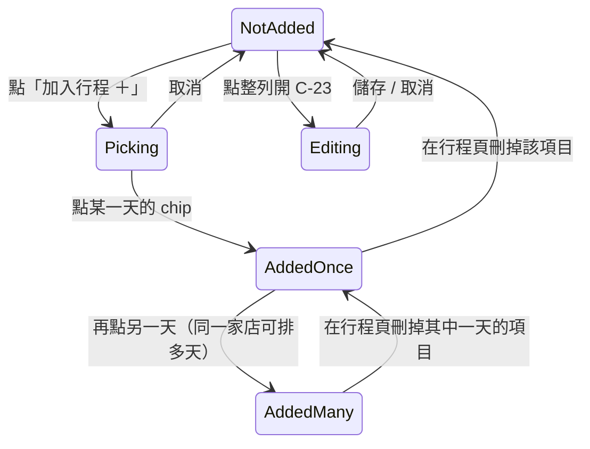

# 櫻旅 Sakura Trip v3「口袋地點」— UI/UX 設計規範（增修）

## 0. 修訂紀錄

| 版本 | 日期 | 依據 | 一句話 |
|---|---|---|---|
| UI v3.0 | 2026-09-01 | PRD v3.3.1 | 初版：P-06、C-18~C-28、S-01~S-19、DDR-09~DDR-24 |
| **UI v3.1** | **2026-09-02** | **PRD v3.6（T-98 實機驗證）** | **IG 的主／輔路徑對調：截圖升為主路徑，IngestSheet 改為依平台分流** |

### 0.1 為什麼要改：一個實機測試推翻了設計前提

UI v3.0 把「貼文文字」設計成 Instagram 的主路徑，截圖只是一行「或選截圖」的次要按鈕。
2026-09-02 CEO 在 iPhone 實機跑 T-98，結果是：

> **IG 的 caption 無法長按選取複製，只能「分享連結／複製連結」。**

於是對 Instagram 而言，三條路只剩一條：

| 路徑 | 可行性 |
|---|---|
| 連結 → 伺服器抓 og:meta | ❌ 機房 IP 撞登入牆（PRD §7.2 早已載明）|
| 貼文文字 → 使用者複製貼上 | ❌ **實測不可行，caption 選不起來** |
| **截圖 → 多模態 LLM 讀圖** | ✅ **IG 唯一可行的內容路徑** |

**UI v3.0 的問題不是文案不夠清楚，是把使用者送去一個做不到的動作**——而且失敗處理（DDR-11）還把焦點
自動送到那個做不到的欄位，等於每次失敗都再把她推回死路一次。所以本次改的是**路徑與版面**，不是措辭。

### 0.2 本次改了哪些章節

| # | 章節 | 改動 |
|---|---|---|
| A | **§6.1（核心）** | 新增 §6.1.0「依平台分流」。IngestSheet 由「單一版面」改為**一個面板、一組欄位、兩種排列**：IG 模式（S-20）把截圖提到最前面並成為首選動作；其他平台維持一般模式（S-10）。連結欄**保留**（來源存證），貼文文字欄**保留但降為選填** |
| B | §6.1.3 | 解析失敗跟著分流：新增 **S-21**（IG 失敗聚焦截圖選擇器），S-13 維持聚焦貼文文字欄。**廢止** v3.0「不得把改用截圖寫成 IG 主要退路」那條禁令——它建立在已被推翻的前提上；該禁令對其他平台仍有效 |
| C | §6.7 C-26 ShortcutCard | **文案降溫**：捷徑只帶得到連結、帶不到內文，文案不得暗示裝了捷徑就能自動解析 IG |
| D | §4 / §6.5 / §12.1 | 併入 PRD v3.5 已裁定四項：`Toast`＝**C-29**（放進 `components/ui.jsx`）、`ConfirmSheet` 加選填 `subtitle`（S-17 用它）、`PLACE_WARN_BYTES = 800_000` 正式引用、補上 `src/lib/share.js` |
| E | §6.2 S-06 | F-78 的 `rawText` / `pending` 欄位已補進 PRD §5.2，明確寫出「重新解析」的預填來源＝`pocket.rawText` + `pocket.sourceUrl` |
| F | §4 元件清單 | 新增 **C-29 Toast**、**C-30 ShotPicker**（截圖選擇器要能在兩種強調層級之間切換，必須是獨立元件）|
| G | §11 DDR | 新增 **DDR-25 ~ DDR-32**；修訂 DDR-10、DDR-11、DDR-19（標註「v3.6 修訂」，編號不變）|
| H | §12.3 | 疑點 ②③④⑤ 技術總監已裁定，改標「已裁定」；新增三個**本次才浮現**的疑點（⑧⑨⑩）|

> 未提及的章節（§2 Tokens、§3 頁面、§6.3 PlaceRow、§6.6 DayPickerSheet、§8 響應式）**內容不變**。
> 「知道排哪一天」仍然是本版唯一賣點，本次修訂完全沒有動到 F-75 那條線。

---

## 1. 概覽

| 項目 | 內容 |
|------|------|
| 對應 PRD | **v3.6**（[../01-PRD/PRD-v3-pocket-places.md](../01-PRD/PRD-v3-pocket-places.md)）|
| 設計版本 | **UI v3.1**（增修，**不取代** [ui-spec.md](ui-spec.md) v2.0）|
| 撰寫角色 | UI/UX 設計師 |
| 日期 | 2026-09-01（初版）／**2026-09-02（v3.1 修訂）** |
| 涵蓋範圍 | **僅 PRD §8 的 MVP（P2–P10）**：F-70~F-78、F-81、F-83、C-05／C-12 增修 |
| 明確不涵蓋 | Phase 1.5 地圖（F-79／F-80／F-84~F-87）、Phase 2 `share_target`（F-82）、Phase 0（F-69，無 UI） |
| 交付物 | 本規範 + [prototype-v3-pocket.html](prototype-v3-pocket.html) |

### 1.1 與 `ui-spec.md` 的銜接關係

本文件是**增修文件**，`ui-spec.md` v2.0 的全部內容（Tokens、P-01~P-05、C-01~C-17、DDR-01~DDR-08）**繼續有效且不被覆寫**。本文件只做三件事：

| 動作 | 內容 |
|------|------|
| **新增頁面** | `P-06`（接續 P-05 往下編） |
| **新增元件** | `C-18` ~ `C-28`（接續 C-17 往下編）；**v3.1 增 `C-29 Toast`、`C-30 ShotPicker`** |
| **增修既有元件** | `C-05 BottomNav`（5 → 6 格）、`C-12 SyncStatusBadge`（外顯失敗原因）、**`C-16 ConfirmSheet`（加選填 `subtitle`，v3.1）**；三者**編號不變**，差異見 §4、§6.5、§6.8 |
| **新增決策** | `DDR-09` ~ `DDR-24`（接續 DDR-08 往下編） |
| **新增狀態** | `S-01` ~ `S-19`（v2 規範未正式編號狀態，本版起啟用 S-XX）；**v3.1 增 `S-20`／`S-21`** |

Tokens **不新增任何一個色票、字級或圓角**。v3 全部畫面只用 `ui-spec.md` §2 已定義的 Token（§2 有增補對照表，但無新值）。

### 1.2 本版要解決的一句話

> 使用者在沙發上滑 IG 看到想去的店 → 存進櫻旅 → **櫻旅告訴她這家店該排哪一天** → 一點寫進行程。

「知道排哪一天」是本版唯一的賣點。**地圖不是。** 所有文案、空狀態、引導都必須指向這條線。

**v3.1 補一句**：上面那句話的第一步「存進櫻旅」，在 Instagram 上**只能靠截圖**（§0.1）。
所以引導文案的責任不只是「說清楚」，而是**在正確的平台把正確的那個動作放在最顯眼的位置**。

### 1.3 設計原則（本版新增，疊加於 v2 的四條）

5. **誠實優先於漂亮** — IG 連結抓不到內文、caption 也複製不了，就直說，並把她導向**真的做得到**的那條路（截圖），不用「智慧解析」這種話包裝（DDR-19、DDR-25）。
9. **（v3.1 新增）引導要依平台分流，不做一體適用** — 同一句「請貼上貼文文字」在 Threads 上有效、在 IG 上是死路。平台不同，第一個該做的動作就不同（DDR-25、DDR-26）。
6. **AI 產出一律先給人看** — 解析結果絕不自動寫入，覆核步驟是硬性關卡（F-72）。
7. **失敗不換頁** — 解析失敗留在原地、保留使用者已輸入的內容、把游標送到最可能成功的欄位（DDR-11）。
8. **同一個地點，兩處長得一模一樣** — 口袋裡的地點與行程裡的項目共用 `ITEM_TYPES` 的圖示與色塊（DDR-16）。

---

## 2. 設計 Tokens（沿用，零新增）

> **本版不新增任何 Token。** 下表是「v3 新元件用到哪些既有 Token」的對照，供開發員查核用。

### 2.1 色彩用途對照

| 用途（v3） | 沿用 Token | Tailwind class |
|---|---|---|
| 口袋頁背景 / 卡片 / 邊框 | `--c-bg-grad` / `--c-surface` / `--c-border` | 與 P-01~P-05 完全相同 |
| 主要動作（解析、加入口袋、加入行程、儲存） | `--c-primary` | `bg-rose-400` |
| 「建議」badge（F-75） | `--c-primary` 淡版 | `bg-rose-100 text-rose-600` |
| 「已加入 Dn」badge（F-75） | 成功語意 | `bg-emerald-50 text-emerald-600` |
| 低 confidence 警示列（F-72） | 進行中語意 | `bg-amber-50 border-amber-200 text-amber-700` |
| 「已存過」badge（F-72） | 中性 | `bg-slate-100 text-slate-500` |
| 容量將滿（F-76）、同步失敗原因（F-77） | 警示語意 | `bg-rose-50 text-rose-600` |
| **截圖選擇器・IG 模式（主要動作，v3.1）** | `--c-primary` 淡版 | `bg-rose-50 border-2 border-rose-300 text-rose-600` |
| 截圖選擇器・一般模式（次要）、「待解析」卡片 | 中性 | `text-rose-300` / `border-dashed border-pink-200` |
| **IG 提示條 / 解析失敗訊息條** | 進行中語意 | `bg-amber-50 border-amber-200 text-amber-700` |

### 2.2 地點類別色（**硬性：不得自訂**）

| 類別 | `ITEM_TYPES[].c` | 圖示（lucide） |
|---|---|---|
| `spot` 景點 | `bg-purple-100 text-purple-600` | `MapPin` |
| `food` 美食 | `bg-amber-100 text-amber-600` | `Utensils` |
| `shop` 購物 | `bg-pink-100 text-pink-600` | `ShoppingBag` |
| `move` 交通 | `bg-sky-100 text-sky-600` | `Train` |
| `stay` 住宿 | `bg-rose-100 text-rose-600` | `BedDouble` |
| `other` 其他 | `bg-gray-100 text-gray-500` | `Sparkles` |

來源 `src/views/trip/constants.js`。`src/views/places/constants.js` **僅 re-export**，不得複製、不得改色（DDR-16）。

### 2.3 六格 BottomNav 的 class 對照表（**硬性：禁止字串內插**）

Tailwind 會 purge 掉樣板字串產生的 class，`grid-cols-${n}` 會在建置後消失（PRD 風險 #8、T-86）。規範寫法：

```jsx
const COLS = { 5: "grid-cols-5", 6: "grid-cols-6" };   // ✅ 明確字面值
// ❌ 禁止：`grid-cols-${tabs.length}`
<div className={`max-w-2xl mx-auto ${COLS[tabs.length] || COLS[5]}`}>
```

375px 下每格寬 62.5px、高 ≈ 55px（`py-2.5` + icon 20px + label 11px），皆 ≥ 44px。

### 2.4 間距 / 圓角 / 動畫

全數沿用 `ui-spec.md` §2.5 / §2.6。新面板一律 `--r-card`（`rounded-2xl`）、底部彈窗 `rounded-t-3xl`、轉場 `--dur 180ms` + `--ease`。

---

## 3. 頁面清單（新增）

| 編號 | 頁面 | 路由 | 對應 PRD | 優先 |
|------|------|------|----------|------|
| **P-06** 🆕 | 口袋 Pocket | `tab=places` | F-73~F-78、F-70~F-72（經 C-19）、F-83 | 🔴 |

> P-01~P-05 定義見 `ui-spec.md` §3，不變。
> **P-05 設定頁**新增一張卡片（C-26 iOS 捷徑設定，F-81），頁面編號不變，規格見 §6.5。
> 路由維持既有的 tab state（`App.jsx` 的 `useState`），無前端 router；`tab` id 用 `places`（對齊 `src/views/places/` 資料夾）。

---

## 4. 元件清單（新增 C-18 ~ C-30）

| 編號 | 元件 | 類型 | 對應 PRD | 檔案 |
|------|------|------|------|------|
| **C-18** 🆕 | IngestBar | P | F-70 | `views/places/PocketView.jsx` 內 |
| **C-19** 🆕 | IngestSheet | C | F-70/71/72/78/83 | `views/places/IngestSheet.jsx` |
| **C-20** 🆕 | ReviewRow | P | F-72 | `views/places/IngestSheet.jsx` 內 |
| **C-21** 🆕 | PocketCard | C | F-73 | `views/places/PocketCard.jsx` |
| **C-22** 🆕 | PlaceRow | P | F-73/74/75 | `views/places/PlaceRow.jsx` |
| **C-23** 🆕 | PlaceSheet | C | F-74/75 + §6.4 | `views/places/PlaceSheet.jsx` |
| **C-24** 🆕 | DayPickerSheet | C | **F-75** | `views/places/DayPickerSheet.jsx` |
| **C-25** 🆕 | DayChip | P | F-75 | `views/places/DayPickerSheet.jsx` 內 |
| **C-26** 🆕 | ShortcutCard | P | F-81 | `views/setting/ShortcutCard.jsx` |
| **C-27** 🆕 | CapacityNotice | P | F-76 | `views/places/PocketView.jsx` 內 |
| **C-28** 🆕 | SyncReasonNote | P | F-77 | `components/SyncReasonNote.jsx` |
| **C-29** 🆕 | Toast | P | F-72／F-75 的操作回饋 | **`components/ui.jsx`**（不另開新檔，PRD §6.2 裁定；DDR-29）|
| **C-30** 🆕 | ShotPicker | P | **F-71（IG 主路徑）** | `views/places/IngestSheet.jsx` 內（DDR-31）|

**增修既有元件（編號不變）**

| 編號 | 元件 | 增修內容 |
|------|------|---------|
| C-05 | BottomNav | 5 格 → 6 格，用 §2.3 的明確 class 對照表 |
| C-12 | SyncStatusBadge | `failed` 時可展開 C-28，顯示 `validateTrip()` 的 `reason` |
| C-16 | ConfirmSheet | **新增選填 `subtitle` prop**（v3.1）：預設值＝現有硬寫的「刪除後旅伴端也會一併移除，無法復原」，向下相容，既有 4 個呼叫點不用改。S-17「要放棄修改嗎？」用它換掉不相干的刪除警告（PRD §6.2、DDR-30）|

---

## 5. 使用者流程圖



---

## 6. 頁面詳細規格

### 6.0 全域框架增修

| 區 | 增修 |
|----|------|
| BottomNav（C-05） | 6 格：行程 / 帳本 / 清單 / 相簿 / **口袋** / 設定。**「口袋」插在「相簿」與「設定」之間**，維持「設定永遠在最右」的既有肌肉記憶（DDR-09） |
| 口袋圖示 | lucide `Bookmark`（與既有 5 個 lucide 圖示同一套、同 20px） |
| Header | 不變。`failed` 時徽章下方可展開 C-28（§6.7） |
| 開機 | `?share=` / `?share_text=` 存在時，載入完成後**自動開啟 C-19 並預填**（F-83）。網址參數在 `replaceState` 後不得殘留（T-96）。**v3.1：預填後立刻執行平台判定——`?share=` 帶的是 IG 連結（走捷徑的最常見情況）就直接以 S-20 開啟，使用者一眼看到的就是截圖區，不必先按錯一次** |

---

### P-06 口袋 Pocket

**佈局（由上而下）**

| 區塊 | 規格 |
|------|------|
| C-18 IngestBar | 全寬 `Card`，一行說明 + 一顆主按鈕「＋ 收藏一則貼文」（`bg-rose-400`，高 44px）。**這一列不是輸入框**，點了開 C-19（DDR-10b）。<br/>說明文案（v3.1）：「看到想去的店，把**截圖**、連結或貼文文字丟進來，我幫你拆成地點、再告訴你排哪一天。」 |
| C-27 CapacityNotice | 僅在容量接近上限時出現（§6.4） |
| 貼文卡片列表 | C-21 依 `createdAt` **新 → 舊**排序 |
| 底部留白 | 96px（讓 BottomNav 不遮最後一張卡） |

**狀態**

| 編號 | 狀態 | 畫面 |
|------|------|------|
| **S-01** | 空（`pockets` 與 `places` 皆空） | 🌸 圖示 + 標題「**口袋是空的**」+ 三行說明（v3.1 改）：<br/>「滑 IG 看到想去的店，**截一張有說明文字的圖**丟進來。」<br/>「Threads、小紅書、YouTube 則可以直接貼連結或貼文文字。」<br/>「櫻旅會拆成一個個地點，再告訴你這家店**適合排哪一天**。」+ 主按鈕「＋ 收藏一則貼文」+ 一行次要連結「設定 iOS 捷徑，從 IG 分享選單直接開櫻旅」→ 切到 P-05 |
| **S-02** | 有內容 | 貼文卡片列表 |
| **S-03** | 離線 | 沿用既有 C-17 OfflineBanner；C-18 按鈕文案不變，面板內才提示（S-14） |

> **S-01 文案硬性限制**：不得出現「地圖」「地圖總覽」「所有收藏落在同一張地圖」「連結 Google 帳號」「同步我的清單」等字樣（PRD §4.5、§6.1、風險 #15）。空狀態的賣點只有一句：**知道排哪一天**。
> **v3.1 追加**：空狀態**不得**把「貼上貼文文字」寫成 IG 的做法（T-98 已證實做不到）；也不得寫成「裝了捷徑就能自動存下 IG 內容」（DDR-32）。

---

### 6.1 C-19 IngestSheet — 收藏面板（所有入口的共同終點）

全螢幕底部彈窗（`inset-0` 遮罩 + `rounded-t-3xl` 面板，最高 `90vh`，內容可捲動），沿用 C-16 的遮罩模式。**四個入口（C-18 按鈕、S-01 主按鈕、F-83 分享參數、F-78 重新解析）都導到這裡**，不得為某個入口另開畫面。

#### 6.1.0 依平台分流（**v3.1 新增，本次修訂的核心**）

**一個面板、一組欄位、兩種排列。** 分流改的是**順序、視覺主次與引導文案**；
**不改欄位集合、不改送出邏輯、不改覆核步驟、不改容量檢查**（DDR-26）。

| 模式 | 觸發條件 | 欄位順序（由上而下） | 主按鈕 |
|---|---|---|---|
| **一般模式 S-10** | 預設。連結為空，或 hostname 非 `instagram.com` | ① 貼文連結（主）② 貼文文字（主）③ 截圖（次要・虛線） | 「解析看看」 |
| **Instagram 模式 S-20** | 連結的 **hostname** 以 `instagram.com` 結尾 | ① IG 提示條 ② **截圖（首選動作・實線主色）** ③ 來源列（收合的連結）④ 貼文文字（選填・折疊） | 無截圖且無文字 → 「**選擇截圖**」；有其一 → 「解析看看」 |

**平台判定規則（硬性）**

```js
// 必須解析 hostname,不得用 url.includes("instagram.com")
// 否則 https://example.com/?ref=instagram.com 會被誤判成 IG
function detectPlatform(raw){
  const t = (raw || "").trim();
  try{
    const h = new URL(/^https?:\/\//i.test(t) ? t : "https://" + t).hostname.toLowerCase();
    if(/(^|\.)instagram\.com$/.test(h))                  return "instagram";
    if(/(^|\.)threads\.(net|com)$/.test(h))              return "threads";
    if(/(^|\.)(xiaohongshu\.com|xhslink\.com)$/.test(h)) return "xiaohongshu";
    if(/(^|\.)tiktok\.com$/.test(h))                     return "tiktok";
    if(/(^|\.)(youtube\.com|youtu\.be)$/.test(h))        return "youtube";
  }catch{ /* 解析失敗(使用者只貼了一段文字) → other,不切模式 */ }
  return "other";
}
```

> **只有 `instagram` 會切換版面**，其餘平台一律走一般模式（它們的文字通常複製得到）。
> 回傳值同時可作為 `pocket.platform` 的前端初值與 C-21 的平台圖示來源。
> 函式落位建議 `src/lib/share.js`（與 `parseShareParams` 同屬「來源／分享」語意）——
> PRD §6.2 的檔案清單未列此函式，**落位待技術總監確認**（見 §12.3 ⑧）。

| 規則 | 規格 |
|---|---|
| 判定時機 | 連結欄的 `input`／`paste` 事件**即時判定**，無 debounce：貼上的當下版面就換好。F-83 由 `?share=` 開啟時，開啟當下即為正確模式 |
| **不得移動焦點** | 換模式時**絕不 `focus()` 其他欄位**。使用者的手指還在連結欄上，版面重排已經夠突兀，再搶走焦點會讓她打不完字（DDR-26）|
| 保留輸入 | 換模式不清空任何欄位，含已選截圖 |
| **折疊不得藏字** | 切到 S-20 時貼文文字欄預設收合，**但若該欄已經有內容就維持展開**。把使用者剛打的字折疊起來，視覺上等同「內容不見了」 |
| 可逆 | 把 IG 連結刪掉／改成別的網址 → 立刻換回一般模式，同樣不清空 |
| 逃生口 | IG 模式仍保留一行次要文字鈕「**還是先試試這個連結**」→ 照常送出。避免誤判把人鎖死 |
| 播報 | 換模式時 `aria-live="polite"` 播報「Instagram 讀不到內文，已改為截圖優先」（§9）|
| 動畫 | 版面重排 180ms（`prefers-reduced-motion` 下瞬間切換），**不做左右滑動**——那是步驟切換的語彙，不是同一步驟內的重排 |

> **為什麼不做成兩個獨立面板**：F-83 要求 IngestSheet 是所有入口的共同終點。
> 兩個面板＝兩套解析呼叫、兩套失敗處理、兩套覆核步驟，而它們真正的差異只有「先看到哪一欄」。
> 分流做在**排版層**，`S-11 解析中`／`S-12 覆核`／`S-14 離線`／容量檢查四段完全共用（DDR-26）。

#### 6.1.1 步驟一：輸入（**S-10 一般模式**）

**「兩個並列主欄」的設計解讀（DDR-10，v3.1 修訂）**：375px 螢幕無法把 URL 欄與多行 textarea 左右並排，
「並列」指的是**視覺同權重、上下堆疊**。**v3.1 起這句話只適用於一般模式**——在 Instagram 模式下，
與連結視覺同權重（其實是更高權重）的是**截圖**，不是貼文文字。

| 順序 | 元素 | 規格 |
|---|---|---|
| 1 | 標題列 | 「收藏一則貼文」+ 右上關閉 ✕（44px） |
| 2 | **主欄 ①** | label「貼文連結」+ `Field`（`inputMode="url"`）+ placeholder「貼上 IG／Threads／小紅書／TikTok／YouTube 連結」 |
| 3 | **主欄 ②** | label「貼文文字」+ `textarea`（4 行起、可長到 8 行）+ placeholder「長按貼文 → 拷貝，把提到店名的那段貼進來」 |
| 4 | 誠實提示 | 主欄 ② 下方一行 `--t-cap` 灰字：「Threads、小紅書、YouTube 的說明文字通常複製得到，貼過來成功率最高。**Instagram 複製不了，貼連結我會請你改用截圖。**」（DDR-19）|
| 5 | 次要路徑 | 分隔線「或」+ **C-30 ShotPicker（`emphasis="secondary"`）** |
| 6 | 主按鈕 | 「解析看看」（`bg-rose-400`，全寬，高 44px）。**三個欄位全空時停用** |

#### 6.1.1b 步驟一：輸入（**S-20 Instagram 模式 — F-71 主路徑**）

> 觸發即顯示，**不需要使用者先按錯一次才告訴她**。PRD §4.2 F-70：「偵測到 `instagram.com` 連結時，
> **立刻**提示並把截圖選擇器提到最前面」。

| 順序 | 元素 | 規格 |
|---|---|---|
| 1 | 標題列 | 同 S-10 |
| 2 | **IG 提示條** | `bg-amber-50 border border-amber-200 text-amber-700 rounded-xl p-2.5`，`role="status"`：<br/>「**Instagram 的內文櫻旅讀不到。** 連結被登入牆擋住，caption 也沒辦法長按複製。<br/>**請截一張把說明文字展開的圖**，我從圖上讀店名。」 |
| 3 | **截圖區（首選動作）** | **C-30 ShotPicker（`emphasis="primary"`）**，緊接提示條下方，是畫面上**視覺最重的一塊** |
| 4 | 截圖指引 | 截圖區下方三行 `--t-cap`（文案見下，**硬性**）|
| 5 | 來源列 | 把連結收合成一行：`🔗 instagram.com/reel/C8xk2…`（`truncate`）+ 右側「改連結」文字鈕（點了展開回可編輯 `Field`）。旁註 `--t-micro` 灰字：「連結會存成來源，之後想回去看原貼文靠它。」 |
| 6 | 貼文文字（選填・折疊） | 折疊標題「**如果你複製得到文字（選填）▾**」，展開才出現 textarea。placeholder 改為「作者置頂留言、或你自己打的店名也可以」 |
| 7 | 主按鈕 | 無截圖且無文字 → 「**選擇截圖**」，點擊＝直接開檔案選擇器，**不送出請求**（DDR-27）；有截圖或有文字 → 「解析看看」 |
| 8 | 逃生口 | 主按鈕下方一行 `--t-cap` 文字鈕「還是先試試這個連結」→ 照常 POST（DDR-27）|

**截圖指引文案（硬性：必須具體到「展開後的 caption 或字幕」，不得只寫「請截圖」）**

> **要截「有字的那一張」，不是食物特寫。**
> ・貼文：先點 caption 的「**更多**」把整段展開，再截
> ・Reels／影片：截**有字幕、或有說明文字**的那一秒
> ・只有食物或風景畫面的圖**認不出店名**，多半會解析失敗

**C-30 ShotPicker 規格（新增元件）**

| 項目 | 規格 |
|---|---|
| 實作 | `<label>` 包 `<input type="file" accept="image/*" multiple class="hidden">`，沿用 `ChecklistCard.jsx:98` 既有模式（不自創檔案選擇器）。**`multiple` 為 v3.2 新增** |
| 張數 | **最多 3 張**（PRD §7.5b）。已達 3 張時選擇區轉為停用態並顯示「已達上限 3 張」，仍可逐張移除後再加 |
| `emphasis="primary"`（IG 模式）| 整塊 `min-h-24`（96px）、`bg-rose-50 border-2 border-rose-300 text-rose-600 rounded-2xl`、置中 24px 相機圖示 + 「**選截圖**」，下方 `--t-micro` 副標「caption 分兩三屏就多截幾張，最多 3 張」 |
| `emphasis="secondary"`（一般模式）| 高 44px、`border border-dashed border-pink-200 text-rose-300 rounded-xl`、「📷 或選截圖」 |
| 已選檔 | **橫向排列的 40×40 縮圖列**，每張右上 ✕（`aria-label="移除第 N 張截圖"`，命中區 44px）。縮圖列上方顯示「已選 N 張」。**IG 模式選完仍維持 primary 外觀**，不縮成小按鈕（它還是這一步的主角）|
| 順序 | 縮圖依選取順序排列，**順序即送出順序** —— 後端會標「第 N 張（共 M 張）」給模型（PRD §7.5c），所以順序有意義。MVP 不提供拖曳重排，使用者可移除後重選 |
| 壓縮 | **逐張**壓到 `OCR_MAX = 1024` / `OCR_QUALITY = 0.7`（PRD §7.5，**不動購物清單的 320px 預設**）。壓縮中該張縮圖顯示「處理中…」，不阻塞面板其他欄位。⚠ `compressImage()` 回傳的是 **data URL**，送出前必須 strip `data:image/jpeg;base64,` 前綴（PRD §7.5a 陷阱 1）|
| 觸控 | 兩種外觀皆 ≥ 44px；`aria-label="選擇截圖"` |

**驗證規則（v3.1 修訂）**

| 條件 | 行為 |
|---|---|
| 連結、文字、截圖皆空 | 主按鈕停用（`bg-slate-300`，`aria-disabled="true"`） |
| **IG 模式，只有連結** | 主按鈕**不停用**，但文案為「**選擇截圖**」，點擊＝開檔案選擇器，**不打 API**（那次請求註定失敗，且會白白吃掉端點的 IP 限流額度，DDR-27）。要硬送請按「還是先試試這個連結」 |
| 只有連結（非 IG） | 可送出（後端走 oEmbed／og 降級階梯） |
| 只有文字（任何長度） | 可送出（< 40 字時後端會落到其他順位，不在前端擋） |
| **只有截圖** | 可送出（後端第 4 順位多模態讀圖）|
| 貼上的連結沒有 `https://` | 前端**不改寫、不報錯**，交給既有 `normalizeUrl()`；但平台判定會自行補 `https://` 後再解析 hostname（見上方 `detectPlatform`）|

#### 6.1.2 步驟二：解析中（S-11，**兩種模式共用**）

| 元素 | 規格 |
|---|---|
| 主按鈕 | 變 `Loader2` 轉圈 + 「解析中…」，`disabled` |
| 欄位 | 維持可見、`readOnly`、透明度 60%（**不清空**）。**C-30 一併鎖住**（`pointer-events-none`），避免解析途中換圖造成送出內容與畫面不一致 |
| 骨架 | 按鈕下方 3 條 `bg-pink-100` 骨架列（`animate-pulse`），暗示「會出現一份清單」 |
| 取消 | 標題列 ✕ 仍可點，關閉即放棄本次解析 |

#### 6.1.3 步驟三：解析失敗（**S-13 一般 ／ S-21 Instagram**）——**不換頁**

PRD §7.2 第 5 順位的處理是整個功能體驗的關鍵。**v3.1 起，失敗處理跟著平台分流**：
把焦點送到「這個平台上真的做得到」的那個欄位。

| 規則 | **S-13 一般模式** | **S-21 Instagram 模式** |
|---|---|---|
| 停留位置 | 維持在輸入步驟，不跳錯誤頁、不關面板 | 同左 |
| 輸入內容 | 一律保留（連結、文字、已選截圖）| 同左 |
| **焦點** | `focus()` **貼文文字欄**，並捲到可視範圍 | **`focus()` C-30 截圖選擇器**（**不是**文字欄），並捲到可視範圍 |
| 訊息條位置 | 貼文文字欄**上方** | **取代 IG 提示條的位置**（截圖區上方）——兩條同時出現會互相稀釋，失敗訊息優先 |
| 訊息條樣式 | `bg-amber-50 border-amber-200 text-amber-700 rounded-xl p-2.5`、`role="alert"` | 同左 |

**訊息條文案（依 `reason` × 模式）**

| `reason` | S-13 一般模式 | S-21 Instagram 模式 |
|---|---|---|
| `need_text_or_image` | 「這個連結**讀不到內文**。請長按貼文 → 拷貝，把**寫店名的那段文字**貼在下面。」 | 「**讀不到，IG 一定是這樣。** 請截一張**把說明文字展開**的圖（影片就截有字幕的那一幕）再試一次。」 |
| `no_places` | 「這段內容裡我找不到具體的店名或景點。再多貼一點文字試試，或直接自己新增。」 | 「這張圖上我找不到店名，**多半是截到食物畫面**。把 caption 點『更多』展開後再截一張。」 |
| `too_large` | 「這張截圖太大了，換一張或改貼文字。」 | 同左 |
| `rate_limited` | 「剛剛解析太多次了，等幾分鐘再試。你貼的內容還留著。」 | 同左 |
| 退路（兩模式皆有）| 訊息條下方一行次要連結「**自己輸入一個地點**」→ 直接跳到 S-12 覆核清單，帶一列空白可編輯的地點 | 同左 |

> **v3.1 廢止 UI v3.0 的一條禁令。** v3.0 寫「不得把『改用截圖』寫成 IG 的唯一或主要退路」——
> 那條禁令建立在「caption 複製得到」的前提上，T-98 已推翻該前提。
> **對 Instagram 而言截圖就是唯一路徑，UI 必須直說。**
> 該禁令**對其他平台仍然有效**：Threads／小紅書／YouTube 失敗時要先請使用者貼文字，不得一律叫人截圖。

#### 6.1.4 步驟四：覆核（S-12，F-72，**兩種模式共用**）

**絕不自動寫入**。畫面切換為清單，輸入欄收合為一行可點開的摘要（「來源：instagram.com/reel/… ▾」）。

| 元素 | 規格 |
|---|---|
| 貼文標題 | AI 產的 `title`，`--t-h2`，**可編輯**（單行 `Field`，15 字內） |
| 摘要 | AI 產的 `summary`，`--t-cap` 灰字，唯讀 |
| 來源列 | 「來源：<host>／<截圖>」+ `--t-micro` 標示 `via`（`text`／`oembed`／`og`／`image`）。**`via: "image"` 時明寫「（從截圖讀出）」**——讓使用者知道這批資料的來源品質，才知道要不要多看兩眼 |
| 地點清單 | 每列一個 **C-20 ReviewRow** |
| 底部固定列 | 主按鈕「**加入口袋 (N)**」，N = 已勾選數。**N = 0 時停用**；上方一行 `--t-cap`「未勾選的不會存進來」 |
| 返回 | 標題列左側「‹ 改一下輸入」回到輸入步驟（**保留已輸入內容，並回到原本的模式**） |

**C-20 ReviewRow 規格**

| 元素 | 規格 |
|---|---|
| 勾選框 | 左側 24px 圓鈕（沿用 `ChecklistCard` 的勾選樣式），命中區 44px |
| 店名 | 單行 `Field`，**可編輯**（貼文原文抄錄常有錯字；**截圖來源的錯字率又更高**，見下方註）|
| 類別 | `<select>`，選項＝`ITEM_TYPES`，選中後左側顯示對應色塊 tag（§2.2） |
| 區域 | 單行 `Field`，placeholder「城市／區域，例：福岡 中洲川端」 |
| 備註 | 單行 `Field`，AI 產的 `note`，可改可清空 |
| 展開 | 預設只顯示「勾選框＋類別 tag＋店名＋區域」一列；點右側 `ChevronDown` 才展開類別／區域／備註編輯（降低 12 列時的視覺噪音） |

**預設勾選規則（T-81）**

| 情況 | 預設 | 視覺 |
|---|---|---|
| 一般（`confidence ≥ 0.6`、非重複） | ✅ 已勾 | 一般樣式 |
| `confidence < 0.6` | ❌ 未勾 | 整列 `bg-amber-50 border border-amber-200`，店名右側加 `--t-micro` amber 字「**名稱可能不準**」 |
| 與既有 `places[]` 同名（`dedupeAgainstSaved()`，規則見 PRD §4.2）| ❌ 未勾 | 店名右側 `bg-slate-100 text-slate-500` badge「**已存過**」 |
| 兩者皆中 | ❌ 未勾 | amber 底 + 兩個標記都顯示 |

> **截圖來源的覆核更重要，不是更不重要。** 截圖走的是多模態讀圖，日文店名的抄錄錯誤率高於純文字輸入，
> 低 `confidence` 的比例會上升。這正是 F-72「絕不自動寫入」的價值所在——
> **主路徑改成截圖之後，覆核步驟從「保險」變成「必經的校對」**，任何簡化覆核的提案都應被拒絕（DDR-24、DDR-25）。

#### 6.1.5 離線（S-14，F-78，**兩種模式共用**）

| 規則 | 規格 |
|---|---|
| 面板頂部 | `bg-amber-100 text-amber-700` 一行：「📴 現在離線，先幫你存起來，回到網路再解析。」 |
| **截圖的誠實警語（v3.1 新增）** | 若離線時已選了截圖，橫幅**必須**追加第二行：「**截圖沒辦法離線保存**，回到網路後請再選一次。」——PRD §5.5 硬性規定圖片 bytes 絕不進 trip jsonb，離線只存得下文字（見 §12.3 ⑨）|
| 主按鈕 | 文案改為「**先存起來**」（不叫「解析看看」，避免承諾做不到的事） |
| 送出後 | 寫入一則 `title: "待解析"` 的 pocket：連結存 **`sourceUrl`**、貼文文字存 **`rawText`**、標記 **`pending: true`**（PRD §5.2）。關閉面板，回 P-06 |

### 6.2 C-21 PocketCard — 一則貼文收藏（F-73）

沿用 `ChecklistCard` 的 `Card` 外觀。

| 區 | 規格 |
|---|---|
| 標題列 | 平台圖示（`Instagram`／`Youtube`／`Link` 等 lucide 16px，`text-rose-300`）+ AI 貼文主題（`--t-h2`，truncate）+ 右側地點數「3 個地點」（`--t-cap`）+ `ChevronDown`／`ChevronUp` |
| 第二行 | `summary`（`--t-cap` 灰字，最多兩行）|
| 動作列（收合時也在） | 「開原貼文」（`ExternalLink`，`openUrl(sourceUrl)`；無連結則不顯示）／「刪除整則」（`Trash2` → C-16 確認） |
| 展開區 | C-22 PlaceRow 列表，`space-y-1.5` |

**狀態**

| 編號 | 狀態 | 畫面 |
|---|---|---|
| **S-04** | 收合 | 只有標題列 + summary |
| **S-05** | 展開 | + 地點列表。**最新的一則預設展開，其餘預設收合**（DDR-22） |
| **S-06** | 待解析（F-78） | 標題顯示「⏳ 待解析」+ `rawText`（或 `sourceUrl`）前 40 字；整張卡 `border-dashed`；動作列換成主按鈕「**重新解析**」→ 開 C-19 並**以 `pocket.rawText` 預填貼文文字欄、以 `pocket.sourceUrl` 預填連結欄**（PRD §5.2 已於 v3.5 補上這兩個欄位）。開啟後平台判定照常執行：`sourceUrl` 是 IG → 直接進 S-20。離線時該按鈕停用並顯示「回到網路再試」 |
| **S-06b** | 待解析且來源是 Instagram（v3.1）| 同 S-06，但**按鈕文案改為「補一張截圖再解析」**。原因：離線時存不下圖片（§6.1.5），IG 又只有截圖這條路，寫「重新解析」會讓使用者以為按下去就會自己跑完（DDR-25）|
| **S-07** | 手動新增（`pocketId === ""`） | 固定置底一張卡「📌 自己加的地點」，無來源連結、不可刪整張卡 |

---

### 6.3 C-22 PlaceRow — 一個地點列（F-73/74/75）

**視覺必須與 `ItemRow`（C-08）同源**：同樣的 `bg-pink-50 rounded-xl p-2.5`、同樣的類別 tag、同樣的圖示尺寸。差別只有右側動作鈕。

```
┌──────────────────────────────────────────────┐
│ [🍜 美食]  一蘭拉麵 福岡總本店          [📍] [＋] │
│ 福岡 中洲川端 · 已加入 D2、D3                    │
│ 24小時營業，豚骨拉麵名店…                        │
└──────────────────────────────────────────────┘
```

| 元素 | 規格 |
|---|---|
| 類別 tag | `ITEM_TYPES[].c` + 圖示 + label，`--t-micro`（與 `ItemRow` 完全一致） |
| 店名 | `--t-body` 500 字重，`break-words`（不 truncate，日文店名長） |
| 第二行 | `area`（`--t-cap`）；若已加入行程，後接 `·` + `bg-emerald-50 text-emerald-600` badge「已加入 D2、D3」（由 `daysForPlace()` 反查，DDR-23） |
| 第三行 | `note`，`--t-cap` 灰字，最多兩行 |
| 地圖鈕 📍 | `text-sky-400`、32×36 命中區（同 `ItemRow`）、`aria-label="地圖"` → `openMap(name + " " + area)`（F-74） |
| 加入行程鈕 ＋ | `text-rose-400`、32×36、`aria-label="加入行程"` → 開 C-24（F-75） |
| 點整列 | 開 C-23 PlaceSheet（詳情／編輯／刪除） |

**狀態**

| 編號 | 狀態 |
|---|---|
| **S-08** | 一般 |
| **S-09** | 已加入至少一天（顯示 emerald badge；**仍可再加**，同一家店可排多天） |

---

### 6.4 C-27 CapacityNotice — 容量保護（F-76）

| 時機 | 畫面 |
|---|---|
| 寫入前試算 `> PLACE_BUDGET_BYTES (900KB)` | 覆核步驟底部主按鈕上方插入 `bg-rose-50 text-rose-600 rounded-xl p-3`，主按鈕同時停用 |
| P-06 頁面上（> **`PLACE_WARN_BYTES = 800_000`** 的黃字預警）| IngestBar 下方常駐一條 `bg-amber-50 text-amber-700`，不擋任何操作 |

**文案（見 §11 的 PRD 疑點 ②，此為建議文案）**

> **快滿了。** 這份行程的資料剩下不到 10%。
> 最占空間的通常是**待購清單的相片**，其次是舊的口袋地點。
> ［去清單頁看看］［去口袋清舊地點］

**理由**：PRD §4.2 F-76 原文案是「口袋空間快滿了，先清掉一些舊地點」，但 PRD §5.5 自己指出「真正的容量壓力來自既有的購物清單照片」（150 個地點僅 ≈54KB，一張壓縮相片就可能上看數十 KB）。照原文案寫，使用者會刪掉一堆地點卻發現空間沒回來——那正是 F-76 想避免的「撞到不可行動的牆」。

> **v3.1：此疑點已裁定。** PRD v3.4 已修正 F-76 文案為「先指向待購清單的相片」，PRD v3.5 §5.3 亦正式定義
> **`PLACE_WARN_BYTES = 800_000`**（80 萬黃字預警）與 `PLACE_BUDGET_BYTES = 900_000`（90 萬擋下）。
> 本節的兩段門檻**直接引用這兩個常數**，不得在元件內寫死數字。
> **截圖走 IG 主路徑不會增加容量壓力**：圖片只在請求中送給端點，**不進 trip jsonb**（PRD §5.5 硬性規定），
> 存下來的仍然只有文字欄位（一筆 place ≈ 361B）。

---

### 6.5 C-23 PlaceSheet — 地點詳情（§6.4 明確儲存鈕）

底部彈窗，沿用 C-16 遮罩模式。

| 區 | 規格 |
|---|---|
| 標題列 | 類別 tag + 店名 + 右上 ✕ |
| 表單 | 店名（`Field`）／類別（`<select>`，`ITEM_TYPES`）／區域（`Field`）／備註（`textarea` 3 行） |
| 日文名 | 若 `nameJa` 非空，區域欄下方一行 `--t-cap` 灰字「日文名：一蘭 福岡本社総本店」。**MVP 唯讀、不可編輯**（DDR-15b） |
| 動作列 | ［在地圖搜尋 📍］（次要，`border`）／［加入行程 ＋］（次要）／［**儲存**］（主按鈕 `bg-rose-400`，全寬置底） |
| 順手提示 | 地圖鈕下方一行 `--t-cap` 灰字：「在 Google 地圖上按它自己的『儲存』，可以放進**你自己的** Google 清單。櫻旅讀不到那份清單，兩邊不會互通。」（PRD §1.5.4；措辭必須明說**不會互通**，見 DDR-19） |
| 刪除 | 面板底部一行紅字「刪除這個地點」→ C-16 確認 |

**狀態**

| 編號 | 狀態 | 規格 |
|---|---|---|
| **S-15** | 閱讀／編輯中 | 任一欄位變動後，「儲存」鈕亮起並顯示「有未儲存的變更」 |
| **S-16** | 已儲存 | 按鈕短暫變「✓ 已儲存」180ms 後關閉面板 |
| **S-17** | 未存離開 | 有未儲存變更時點 ✕ 或遮罩 → C-16 確認，**帶入 `subtitle` prop**（v3.1）：<br/>`title="要放棄修改嗎？"`、`subtitle="這個地點剛剛改的內容不會存起來。"`、確認鈕「放棄修改」。<br/>**不得沿用 C-16 硬寫的預設 subtitle**「刪除後旅伴端也會一併移除，無法復原」——那是刪除警告，出現在放棄編輯的情境會讓使用者以為要刪掉地點（PRD §6.2 已裁定新增此 prop，DDR-30）|

> **硬性：不做即時輸入即存。** `useTrip.js:46` 的 `applyRemote` 只保護頂層 scalar 與 `day:<id>:<field>` 格式的 `activeField`，地點欄位不在保護範圍，逐字同步會被 Realtime 合併蓋掉。沿用 `SettingView.jsx:55` 的 `tripName` 明確儲存鈕模式（DDR-15）。

---

### 6.6 C-24 DayPickerSheet — 加入行程並建議日期（F-75，**本版賣點**）

底部彈窗。**這是本版最需要做對的一個畫面。**

| 區 | 規格 |
|---|---|
| 標題 | 「把「**一蘭拉麵 福岡總本店**」排到哪一天？」 |
| 副標 | `--t-cap` 灰字：「標了『建議』的是**當天正好在這個區域**的日子。」 |
| 清單 | C-25 DayChip 垂直列表，**維持行程頁既有順序（D1→Dn）**，可捲動 |
| 底部 | 「取消」文字鈕 |

**C-25 DayChip 規格（全寬列式 chip，見 DDR-14b）**

```
┌──────────────────────────────────────────────┐
│ (D2)  6月11日 週四                    [建議]  │   ← 44px+ 命中區
│       福岡 · 已有 3 項                        │
└──────────────────────────────────────────────┘
```

| 元素 | 來源 | 規則 |
|---|---|---|
| D*n* 徽章 | 索引 | 沿用 `DayCard` 的 `bg-rose-400 text-white rounded-full w-7 h-7` |
| 日期 | `day.date` | `toLocaleDateString("zh-TW", {month:"long", day:"numeric", weekday:"short"})`，與 `DayCard` 一致 |
| 城市 | `day.city.v` | 空則顯示「**未填城市**」（`text-rose-300`） |
| 已有 N 項 | `liveItems(day.items).length` | 「已有 3 項」／0 時「還沒有安排」 |
| **「建議」badge** | `suggestDays(place, days)` | `bg-rose-100 text-rose-600 rounded-full px-2 py-0.5 --t-micro`。**僅標示** |
| 「已加入」badge | `daysForPlace(placeId, days)` | `bg-emerald-50 text-emerald-600`，**仍可再點**（想去兩次） |
| 建議列的底色 | — | `bg-rose-50`（其餘 `bg-pink-50`）。**位置不變** |

**硬性規則（違反即設計錯誤）**

1. **順序永遠是行程原順序**，建議的天**不得**被抽到最上面（PRD §6.3、T-97）。
2. **不自動選、不自動寫入**，建議只是 badge。
3. **零相符時仍列出所有天**，不得改成自動選第一天。
4. `place.area` 或 `day.city` 為空 → 不標建議，也不擋。

**狀態**

| 編號 | 狀態 | 畫面 |
|---|---|---|
| **S-18** | 一般 | 日期列表 |
| **S-19** | 尚無任何天數 | 🗓 圖示 + 「這份行程還沒有日期。先到**行程**頁設好出發／回程，按『產生每日卡片』。」+ 主按鈕「去行程頁」（只切 tab，不新增功能） |

**互動**：點一下 chip → 立即寫入 `days[].items[]`（帶 `placeId`、`type = place.category`、`title = place.name`、`note = place.note`）→ 面板關閉 → C-22 上的「已加入」badge 同步出現（同一次 commit，T-83）→ 頁面頂部 toast「已排進 D2（6/11）」，附「去看看」連結。

> **禁止畫成拖曳。** 跨分頁拖曳結構上不可行（每個 `DayCard` 各自持有 `DndContext`，`onDragEnd` 假設起訖同在一天；`App.jsx` 一次只掛載一個分頁）。地點進到某一天之後，本來就能用既有拖曳重排（DDR-13）。

---

### 6.7 P-05 設定頁增修 — C-26 ShortcutCard（F-81）

**比照既有分享連結卡片**（`SettingView.jsx:41-49`）：一段說明 + 唯讀輸入框 + 複製鈕。放在「分享連結」卡之後、「旅程設定」卡之前。

| 元素 | 規格 |
|---|---|
| 標題 | `SectionTitle` + lucide `Share2`：「**iOS 捷徑：從 IG 分享選單直接開櫻旅**」（v3.1 改；原「從 IG 直接存」會被讀成「連內容一起存」）|
| 說明 | `--t-cap`（v3.1 改）：「裝一次之後，在 IG 按分享就會出現『存到櫻旅』，**幫你把連結存成來源、順手打開收藏面板**。**不裝也完全不影響**，照樣可以用貼上的。」 |
| 唯讀欄 | 完整前綴 `https://sakura-trip-omega.vercel.app/?trip=<KEY>&share=` （`readOnly`，`text-xs`，可全選） |
| 複製鈕 | `PinkBtn` + `Copy`，複製後 1.5s 顯示「已複製」（與分享連結卡完全同一套） |
| 三步驟 | 折疊區「怎麼做？▾」展開：<br/>1. 打開「捷徑」App → ＋ → 新增動作「**文字**」，內容貼上上面那段，後面接「**捷徑輸入**」<br/>2. 再加一個動作「**打開 URL**」，帶入上一步的文字<br/>3. 捷徑設定裡打開「**在分享工作表中顯示**」，接受類型勾 **URL 與文字** |
| **誠實提示（v3.1 重寫）** | 最後一段 `--t-cap` 灰字，`bg-amber-50` 淡底以免被略過：<br/>「**IG 分享只給得到連結，給不到貼文內容。** 所以按完『存到櫻旅』之後，面板還是會請你**截一張把說明文字展開的圖**——櫻旅是從那張圖上讀店名的。<br/>捷徑省掉的是**切 App 和貼連結**，不是解析。」（DDR-19、DDR-32）|

> **禁止（v3.1 加嚴）**：
> 1. 不得寫成「安裝捷徑就能自動抓到所有內容」或任何「一鍵存下 IG 貼文」的暗示。
> 2. **不得讓「存到櫻旅」這五個字單獨出現而不說明它存的是什麼**——它存的是連結，不是內容。
> 3. 捷徑的價值主張只有兩個，文案只能講這兩個：**不漏掉來源**、**一鍵開啟收藏面板**（PRD §4.2 F-81 細節 2 + v3.6 裁定）。

---

### 6.8 C-12 增修 + C-28 SyncReasonNote（F-77）

| 規則 | 規格 |
|---|---|
| C-12 `failed` 狀態 | 文字由「失敗·重試」改為「**失敗·看原因**」；點擊行為由「直接重試」改為「展開 C-28」 |
| C-28 位置 | Header 下方，與 C-17 OfflineBanner 同一條位置（兩者不會同時出現：offline 與 failed 互斥） |
| C-28 內容 | `bg-rose-50 text-rose-600 text-xs px-4 py-2`：「同步失敗：**{reason}**」+ 右側「重試」文字鈕 + ✕ 收起 |
| reason 文案對照 | `資料過大` → 「這份行程超過 1MB 上限，先刪一些相片或舊地點」（附［去清單頁］）<br/>`資料格式錯誤` → 「資料格式有問題，請截圖回報」<br/>其他／未知 → 原樣顯示 `reason`，不吞掉 |
| 無障礙 | C-28 `role="alert"`；C-12 `aria-expanded` |

---

## 7. 互動狀態機

### 7.1 收藏流程（C-19 IngestSheet）



> **模式切換是同一個狀態內的重排，不是換頁**：不清空欄位、不移動焦點、不重置解析結果，
> 也**不會**把使用者踢回步驟一（若當下在 S-12 覆核，改連結不影響覆核清單）。

> `Review` 狀態下 `trip.data.places` **必須零變化**（T-80）。唯一的寫入點是 `Review → Closed` 那一條轉移。

### 7.2 地點與行程的關係（C-22 PlaceRow）



badge 文字由 `daysForPlace(placeId, days)` **即時反查**，不存 `usedIn`（PRD §5.2）。因此「寫入行程」與「badge 出現」在資料上是同一件事，不可能出現只有其一的中間狀態（T-83）。

---

## 8. 響應式規則

沿用 `ui-spec.md` §8 的三個斷點，本版補充：

| 項目 | 規格 |
|---|---|
| BottomNav 六格 | compact（375px）每格 62.5px × 55px；標籤「口袋」二字不換行。**最小支援寬度 320px**（每格 53.3px，仍 ≥ 44px） |
| C-19 面板 | `max-h-90vh` + 內容 `overflow-y-auto`；鍵盤彈出時主按鈕固定在面板底部（`position: sticky; bottom: 0`），不被鍵盤蓋住 |
| **C-19 模式切換（v3.1）** | 切到 S-20 時面板高度會變（提示條 + 96px 截圖區進場、文字欄折疊收起）。**捲動位置必須維持在連結欄可見**，不得因為重排把使用者捲到面板底部。實作建議：欄位順序用 flex `order` 切換而非重建 DOM，避免 iOS Safari 在 DOM 重建時把鍵盤收起 |
| **C-30 ShotPicker** | primary 外觀在 320px 下仍為整寬 96px；secondary 外觀 44px。兩者皆不隨斷點改變外觀，只隨模式改變 |
| C-24 面板 | 日期多於 6 天時清單自身捲動，`max-h-60vh` |
| C-20 覆核列 | 一律單欄；12 列時面板捲動，底部「加入口袋 (N)」`sticky` 常駐可見 |
| 展開斷點（> 768px） | 內容仍 `max-w-2xl`，面板同樣 `max-w-2xl mx-auto`，不做雙欄 |
| iOS Safe Area | C-19／C-23／C-24 底部一律 `padding-bottom: calc(1.25rem + env(safe-area-inset-bottom))`（與 C-16 相同寫法） |

---

## 9. 無障礙規範

| 項目 | 規格 |
|---|---|
| 觸控目標 | 六格 nav、覆核勾選框、日期 chip、地圖鈕、加入行程鈕、**C-30 截圖選擇器與其移除 ✕**，皆 ≥ 44px 命中區（小圖示以透明 padding 擴大，沿用 `ItemRow` 的 `w-8 h-9 -my-1` 手法） |
| 狀態雙編碼 | 「建議」不只用 `bg-rose-50` 底色，**必附文字 badge**；低 confidence 不只用 amber 底，**必附「名稱可能不準」文字**；「已存過」必附文字 |
| 對比 | amber-700 on amber-50 ≈ 6.5:1；rose-600 on rose-100 ≈ 5.2:1；slate-500 on slate-100 ≈ 4.8:1，皆 ≥ WCAG AA 4.5:1 |
| 標籤 | 所有圖示鈕加 `aria-label`（地圖／加入行程／展開／收合／移除截圖／複製捷徑前綴） |
| 面板 | C-19／C-23／C-24 皆 `role="dialog" aria-modal="true"`，開啟時焦點移入面板第一個可聚焦元素，`Esc` 關閉，關閉後焦點回到觸發按鈕 |
| 覆核清單 | `<ul role="list">`，每列勾選框為原生 `<input type="checkbox">`（視覺以 CSS 覆蓋），可用鍵盤空白鍵切換 |
| 解析中 | 骨架區 `aria-busy="true"`；完成時 `role="status" aria-live="polite"` 播報「找到 5 個地點，請確認」 |
| **模式切換（v3.1）** | IG 提示條為 `role="status" aria-live="polite"`，切換當下播報「Instagram 讀不到內文，已改為截圖優先」。**只播報、不移動焦點**（DDR-26）|
| 失敗訊息 | `role="alert"`；**同時**用程式移動焦點——一般模式送到貼文文字欄，**Instagram 模式送到 C-30 截圖選擇器**（S-21）|
| **C-30 對比度** | primary 外觀 `text-rose-600` on `bg-rose-50` ≈ 6.1:1；`border-rose-300` 對 `bg-rose-50` 的邊界不作為唯一狀態指示（另有文字標籤）|
| 動態字級 | 全部用 rem；覆核列在 200% 縮放下改為店名獨占一行，不破版 |

---

## 10. 動畫與轉場

| 場景 | 動畫 |
|---|---|
| C-19／C-23／C-24 開啟 | 由下滑入 180ms `--ease` + 遮罩淡入（與 C-16 完全相同） |
| 步驟切換（輸入 → 覆核） | 水平滑動 180ms（覆核由右進、返回由左進） |
| **模式切換（S-10 ⇄ S-20，v3.1）** | 欄位重排 180ms（height + opacity），**不用水平滑動**——水平滑動是「換步驟」的語彙，同一步驟內重排若也用它，使用者會以為自己被帶到別的頁 |
| 解析中骨架 | `animate-pulse` 1s 循環 |
| C-21 展開／收合 | height + opacity 180ms |
| 加入行程成功 | 面板關閉 + toast 由下淡入停 1.8s；C-22 的「已加入」badge 以 opacity 淡入 180ms |
| C-28 展開 | 由上滑入 180ms（與 C-17 OfflineBanner 相同） |

**`prefers-reduced-motion: reduce`**：關閉所有位移與骨架脈衝，改為瞬間切換或 opacity ≤ 100ms（沿用 v2 規則，`prototype.html` 已有該 media query）。

---

## 11. 設計決策記錄（DDR-09 ~ DDR-32）

> **v3.1 修訂了三條既有 DDR**（DDR-10、DDR-11、DDR-19，**編號不變**，內文標「v3.1 修訂」）；
> **新增 DDR-25 ~ DDR-32**。修訂原因一律是 §0.1 的 T-98 實機結果。

| 編號 | 決策 | 理由 |
|---|---|---|
| **DDR-09** | 口袋設為第六個分頁，插在「相簿」與「設定」之間 | 口袋是獨立收件匣，生命週期與清單完全不同（PRD §6.1）；插在設定之前是為了維持「設定永遠在最右」的肌肉記憶，不打亂既有使用者的前四格位置 |
| **DDR-10**<br/>**（v3.1 修訂）** | 「兩個並列主欄」＝**視覺同權重、上下堆疊**，不是左右並排；**且此規則只適用於一般模式** | 375px 放不下一個 URL 欄加一個多行 textarea 左右並排，PRD 要的是「地位對等」而非幾何排列。**v3.1 修訂**：T-98 之後，「哪兩欄對等」取決於平台——一般模式是「連結＋文字」，Instagram 模式是「連結＋**截圖**」，而且截圖的權重還更高。原句「截圖是唯一被降級的那一個」**在 IG 模式下作廢** |
| **DDR-10b** | P-06 頁面上的是**按鈕**不是輸入框，一律導向 C-19 | F-83 要求 IngestSheet 是所有入口的共同終點。頁面上再放一個真的能輸入的欄位，會出現兩套解析流程與兩套失敗處理 |
| **DDR-11**<br/>**（v3.1 修訂）** | 解析失敗留在面板、保留輸入，**焦點送到「這個平台上真的做得到」的那個欄位**：一般模式＝貼文文字欄，Instagram 模式＝截圖選擇器 | PRD §7.2「第 5 順位的 UI 處理是整個功能體驗的關鍵」。IG 幾乎必失敗，失敗是常態不是例外。**v3.1 修訂**：v3.0 一律聚焦貼文文字欄，但 T-98 證明 IG 的 caption 根本選不起來——把焦點送到一個做不到的欄位，等於每次失敗都再把使用者推回死路一次。這是本次修訂裡最容易被忽略、卻最傷人的一行 |
| **DDR-12** | 覆核主按鈕帶數量「加入口袋 (N)」，N=0 停用 | 讓使用者在按下去之前就知道會存進幾筆，是「絕不自動寫入」承諾的可見形式（T-80／T-81） |
| **DDR-13** | 「加入行程」用日期 chip，**不用拖曳** | 跨分頁拖曳結構上不可行：每個 `DayCard` 各持一個 `DndContext`（`DayCard.jsx:84`），`onDragEnd`(:33) 假設起訖同在一天；`App.jsx` 一次只掛載一個分頁。真要做得改動已上線且運作正常的排序程式碼（PRD §6.3） |
| **DDR-14** | 「建議」只加 badge，**不重排順序、不自動選** | 使用者對自己行程的日期順序有既定心智模型（D1→Dn）。把建議抽到最上面會讓她每次都要重新找「第三天在哪」。建議只是提示，決定權在人（T-97） |
| **DDR-14b** | 日期 chip 做成**全寬列式**而非小 pill | 一個 chip 要放 D*n*、日期、城市、項目數、兩種 badge 共五項資訊，375px 下小 pill 放不下且觸控目標不足 44px |
| **DDR-15** | 地點編輯用明確「儲存」鈕，不做即時輸入即存 | `useTrip.js:46` 的 `applyRemote` 只保護頂層 scalar 與 `day:<id>:<field>` 的 `activeField`，地點欄位不在保護範圍，逐字編輯會被 Realtime 合併蓋掉。沿用 `SettingView.jsx:55` 的 `tripName` 模式，而非去擴充已通過 SA 驗收的同步核心（PRD §6.4） |
| **DDR-15b** | `nameJa` 在 MVP 唯讀顯示、不可編輯 | MVP 沒有地圖，`nameJa` 對使用者無立即價值；它的價值在 Phase 1.5 的 geocode 命中率。開放編輯會增加 MVP 的欄位與驗證面積。Phase 1.5 做地圖時再開放（見 §12 疑點 ④） |
| **DDR-16** | 類別色與圖示 **re-export** `ITEM_TYPES`，不自訂 | 讓同一個地點在口袋與在行程中長得一模一樣——視覺上是「同一個東西被搬過去」，不是「被複製成另一種東西」。任何自訂配色都會破壞這個等式（PRD §6.2 硬性要求） |
| **DDR-17** | 容量提示指向**相片**而非只叫使用者刪地點 | 150 個地點 ≈ 54KB，一張壓縮相片可達數十 KB；PRD §5.5 自承「真正的容量壓力來自購物清單照片」。叫使用者刪地點卻不見效，就是 F-76 想避免的「不可行動的牆」（見 §12 疑點 ②） |
| **DDR-18** | 同步失敗徽章改為「失敗·看原因」，展開一條說明 | Header 徽章只有約 70px，塞不下 reason。展開條沿用 OfflineBanner 的位置與樣式，零新視覺語言（F-77） |
| **DDR-19**<br/>**（v3.1 修訂）** | 誠實文案**四處**：① IG 連結抓不到內文**且 caption 複製不了** ② 捷徑只帶得到連結、不帶內容 ③ Google 清單不會互通 ④ **離線存不下截圖** | PRD 風險 #2、#15、§4.2 F-81 細節 2、§5.5。**v3.1 修訂**：第 ① 條原本只講「抓不到內文」，那還留給使用者一個「那我複製文字」的假出口；現在必須把「複製不了」也講出來，否則她會自己去試一次然後失敗。第 ④ 條是本次新發現（§12.3 ⑨）。含糊帶過的代價是使用者把做不到歸因成 App 壞掉 |
| **DDR-20** | 捷徑卡片比照分享連結卡片（唯讀欄 + 複製鈕 + 折疊步驟） | 使用者已經在 P-05 用過一次「複製這段字」的互動，零學習成本；折疊步驟讓沒興趣的人不被三步驟說明淹沒 |
| **DDR-21** | 「待解析」卡片用 `border-dashed` + ⏳ | 虛線是 App 內既有的「尚未完成」語彙（`ChecklistCard` 的加相片框）。它是一張真的卡片而非灰色佔位，因為它確實已經存進資料、旅伴也看得到 |
| **DDR-22** | 最新一則 PocketCard 預設展開，其餘收合 | 剛存完的那一則是使用者當下唯一關心的；其餘收合讓「一頁看完存了幾則貼文」成立 |
| **DDR-23** | 「已加入 D2、D3」由 `daysForPlace()` 反查，不存 `usedIn` | PRD §5.2。反查讓「寫入行程」與「badge 出現」在資料上是同一件事，不可能出現只有其一的中間狀態（T-83），也讓兩人排到不同天不會互蓋 |
| **DDR-24** | 重複偵測只在覆核步驟標示，**不自動合併、不自動移除** | `places` 刻意不進 `dedupeByContent`（PRD §5.4①）：內容去重在每次 merge 都會跑，誤判即永久資料遺失（兩家不同分店的一蘭）。標示 + 預設不勾，讓人看得到並可以否決 |
| **DDR-25** 🆕 | **IG 走截圖、其他平台走文字**——引導依平台分流，不做一體適用 | T-98 實機驗證：IG 的 caption 無法長按選取複製（§0.1）。IG 的三條路只剩截圖一條；而 Threads／小紅書／YouTube 的文字通常複製得到，對它們硬推截圖反而多一道手續。**同一句引導在不同平台上，一個是捷徑、一個是死路** |
| **DDR-26** 🆕 | 分流只換「順序 + 視覺主次 + 文案」，**欄位集合／送出邏輯／覆核／容量檢查完全共用**；換模式時**不移動焦點** | F-83 要求 IngestSheet 是所有入口的共同終點。做成兩個面板＝兩套解析呼叫、兩套失敗處理、兩套覆核，而真正的差異只有「先看到哪一欄」。焦點不動則是因為切換發生在使用者剛貼完連結的當下，手指還在那一欄，搶焦點會讓她打不完字 |
| **DDR-27** 🆕 | IG 模式下若沒有截圖也沒有文字，主按鈕直接變成「**選擇截圖**」（開檔案選擇器），**不送出注定失敗的請求**；另留一行「還是先試試這個連結」逃生口 | 只帶 IG 連結的請求 100% 會落到 `need_text_or_image`（機房 IP 撞登入牆，PRD §7.2）。讓使用者按一顆「解析看看」再等它失敗，是**設計了一個必敗的動作**；而且會白白吃掉端點每 IP 20 次/小時的限流額度（PRD §7.4）。逃生口是為了防平台判定誤判把人鎖死 |
| **DDR-28** 🆕 | IG 模式下連結欄**收合成來源列而不是移除** | 連結是**來源存證**：日後想回看原貼文、想確認 AI 有沒有讀錯，只能靠它（PRD v3.6 明文保留）。但它在 IG 上對「解析」毫無貢獻，佔著第一順位只會誤導。收合成一行既留住價值、又讓出版面 |
| **DDR-29** 🆕 | `Toast` 編為 **C-29 並放進 `src/components/ui.jsx`**，不另開新檔 | PRD §6.2（v3.5）裁定：該檔本來就是 `Card`／`SectionTitle`／`PinkBtn`／`Field` 這類小元件的集散地，專案現無任何 toast。為一個 20 行的元件另開檔案，只會讓 `components/` 多一個要記的名字 |
| **DDR-30** 🆕 | `ConfirmSheet` 加**選填** `subtitle`（預設值＝現有硬寫的刪除警告），S-17 用它 | `ConfirmSheet.jsx:10` 目前把「刪除後旅伴端也會一併移除，無法復原」硬寫在元件裡。S-17 是「要放棄修改嗎？」，跳出刪除警告會讓使用者以為地點要被刪掉。設成**選填且預設值＝原字串**，既有 4 個呼叫點一行都不用改（PRD §6.2 v3.5 已裁定）|
| **DDR-31** 🆕 | 截圖選擇器抽成獨立元件 **C-30 ShotPicker**，用 `emphasis` prop 切主／次外觀；引導文案必須具體到「**展開後的 caption 或影片字幕**」 | 同一個選擇器要在兩種模式下呈現兩種權重，寫成兩段行內 JSX 必然會走樣。文案具體化則是 PRD §4.2 F-71 的明文要求：只寫「請截圖」的話，使用者會截食物特寫——那張圖上沒有店名，解析必失敗，然後她會認為這功能不準 |
| **DDR-32** 🆕 | C-26 ShortcutCard **文案降溫**：捷徑的價值只講「不漏掉來源」與「一鍵開啟收藏面板」 | IG 分享選單只給捷徑一個 URL、不給貼文文字（PRD §4.2 F-81 細節 2 + v3.6 裁定）。捷徑存下來的只有連結、沒有內容，使用者仍需另外截圖。任何「一鍵存下 IG 貼文」的暗示，都會在第一次使用時被戳破，代價是使用者從此不信任這張卡片上的每一句話 |

---

## 12. 附錄

### 12.1 元件 ↔ 檔名 ↔ 原型區塊對照

| 元件 | React 檔（依 PRD §6.2） | 原型區塊 id |
|---|---|---|
| C-05 BottomNav（增修） | `components/BottomNav.jsx` | `#nav`（六格） |
| C-12 SyncStatusBadge（增修） | `components/SyncStatusBadge.jsx` | `#syncBadge` |
| C-18 IngestBar | `views/places/PocketView.jsx` | `#ingestBar` |
| C-19 IngestSheet | `views/places/IngestSheet.jsx` | `#ingest` |
| C-20 ReviewRow | `views/places/IngestSheet.jsx` 內 | `#reviewList > li` |
| C-21 PocketCard | `views/places/PocketCard.jsx` | `.pocket-card` |
| C-22 PlaceRow | `views/places/PlaceRow.jsx` | `.place-row` |
| C-23 PlaceSheet | `views/places/PlaceSheet.jsx` | `#placeSheet` |
| C-24 DayPickerSheet | `views/places/DayPickerSheet.jsx` | `#dayPicker` |
| C-25 DayChip | `views/places/DayPickerSheet.jsx` 內 | `.day-chip` |
| C-26 ShortcutCard | `views/setting/ShortcutCard.jsx` | `#shortcutCard` |
| C-27 CapacityNotice | `views/places/PocketView.jsx` 內 | `#capacity` |
| C-28 SyncReasonNote | `components/SyncReasonNote.jsx` | `#syncReason` |
| **C-29 Toast**（v3.1）| **`components/ui.jsx`**（與 `Card`／`SectionTitle`／`PinkBtn`／`Field` 同檔，**不另開新檔**，PRD §6.2 裁定）| `#toast` |
| **C-30 ShotPicker**（v3.1）| `views/places/IngestSheet.jsx` 內 | `#shotPicker` |
| C-16 ConfirmSheet（增修）| `components/ConfirmSheet.jsx` — **加選填 `subtitle` prop**，預設值＝現有硬寫字串 | `#confirmSheet` |
| （純函式） | `lib/places.js`：`placeToItem` / `pocketBytes` / `dedupeAgainstSaved` / `suggestDays` / `daysForPlace` | — |
| **（純函式，v3.1）** | **`lib/share.js`：`parseShareParams()` / `shortcutPrefix(tripKey)`**（F-81／F-83，PRD v3.5 §6.2 補列）<br/>**＋ 本稿提議的 `detectPlatform(url)`（§6.1.0）——落位待技術總監確認，見 §12.3 ⑧** | — |
| （常數） | `lib/schema.js`：`PLACE_BUDGET_BYTES = 900_000`（擋下）／**`PLACE_WARN_BYTES = 800_000`（黃字預警，PRD v3.5 §5.3 正式定義）**；`lib/image.js`：`OCR_MAX = 1024` / `OCR_QUALITY = 0.7` | — |
| （re-export） | `views/places/constants.js` → `views/trip/constants.js` 的 `ITEM_TYPES` | — |

### 12.2 功能 ↔ 畫面對照（供 SA 驗收查表）

| PRD | 畫面／元件 | SA 測試規則 |
|---|---|---|
| F-70 貼上連結／文字（**其他平台主路徑**）| C-19 **S-10** 兩個主欄 + §6.1.0 平台判定 | T-76、T-77 |
| **F-71 截圖（IG 主路徑，v3.6）** | C-19 **S-20** + **C-30 ShotPicker（primary）** + S-21 失敗聚焦 | **T-98**（已於 2026-09-02 實測，結論已回寫 PRD 與本稿）|
| F-72 覆核 | C-19 S-12 + C-20 | **T-80、T-81** |
| F-73 口袋清單 | P-06 + C-21 + C-22 | — |
| F-74 導航 | C-22 📍 / C-23 地圖鈕 | — |
| F-75 加入行程 + 建議 | C-24 + C-25 | **T-83、T-84、T-97** |
| F-76 容量保護 | C-27 | T-82 |
| F-77 同步原因外顯 | C-12 增修 + C-28 | — |
| F-78 離線待解析 | C-19 S-14 + C-21 S-06 | T-85 |
| F-81 iOS 捷徑 | C-26（P-05） | T-96 |
| F-83 分享參數 | C-19 由 `?share=` 開啟 | T-96 |
| C-05 六格 | §2.3 class 對照表 | **T-86** |

### 12.3 交給技術總監的疑點（設計過程中發現，**未自行改設計**）

> **v3.1 狀態更新**：①③④⑤⑦ 技術總監已於 PRD v3.4／v3.5／v3.6 裁定，改標「✅ 已裁定」並保留紀錄；
> ⑥ 維持原狀；**⑧⑨⑩ 是本次分流設計才浮現的新問題，尚未裁定。**

| # | 位置 | 問題 | 本稿的暫定處理 |
|---|---|---|---|
| ①<br/>**✅ 已裁定** | PRD §4.2 F-78 vs §8 Phase 1 commit 表 | F-78「離線暫存待解析」列在 §4.2（Phase 1 功能表），但 §8 的 P2–P10 **沒有任何一個 commit 涵蓋它**（P6 只寫「含 F-72 覆核、F-76 試算」）。T-85 卻列在 MVP 測試規則裡 | 本稿照 MVP 設計（C-19 S-14 + C-21 S-06）。**PRD v3.4 已把 F-78 明確歸入 P6 commit，並於 v3.5 補上 `rawText`／`pending` 欄位——本稿 S-06 已改為明確引用這兩個欄位** |
| ②<br/>**✅ 已裁定** | PRD §4.2 F-76 文案 vs §5.5 容量評估 | F-76 指定文案為「口袋空間快滿了，先清掉一些舊地點」，但 §5.5 自承「真正的容量壓力來自既有的購物清單照片」（150 地點僅 ≈54KB）。照原文案，使用者刪光地點也回收不了多少空間 | **PRD v3.4 已採用本稿文案**（先指向待購清單相片），v3.5 §5.3 另補 `PLACE_WARN_BYTES = 800_000`。§6.4 已改為直接引用兩個常數 |
| ③<br/>**✅ 已裁定** | PRD §4.2 F-72「與既有 `places[]` 同名」 | **未定義「同名」的比對規則**：是否正規化（去空白／全半形）？是否要一併比 `area`？「一蘭拉麵 福岡總本店」vs「一蘭 福岡本社総本店」算不算同名？ | **PRD v3.4 已補完整 `dedupeAgainstSaved()` 規則**（正規化 → `{name, nameJa}` 集合取交集 → 不比對 `area` → 僅供提示）。本稿 §6.1.4 已改為引用該規則 |
| ④<br/>**✅ 已裁定** | PRD §5.2 `nameJa` vs MVP 範圍 | `nameJa` 在 MVP 完全沒有用途（地圖在 Phase 1.5），但 T-91 指出它是 geocode 命中率的關鍵變因 | **PRD v3.4 裁定 MVP 唯讀**，與本稿 DDR-15b 一致，不需改設計 |
| ⑤<br/>**✅ 已裁定** | PRD §10 T-83 措辭 | T-83 要求「badge 與寫入在**同一次推送**中一致」。但 §5.2 已決定不存 `usedIn`、badge 由 `daysForPlace()` 反查 —— 在這個設計下兩者本來就是同一份資料，不存在「只有其一」的可能 | **PRD v3.4 已依本稿建議改寫 T-83 措辭**，不需改設計 |
| ⑥ | PRD §4.2 F-75 錯誤處理 | 「尚未產生任何天數 → 提示先去行程頁設定日期區間」，但沒說是否可以提供跳轉 | 本稿在 S-19 放了一顆「去行程頁」按鈕（僅切 tab，不新增功能）。若視為超出範圍請告知 |
| **⑧**<br/>🆕 v3.1 | PRD §6.2 檔案清單 vs §6.1.0 平台判定 | 依平台分流需要一個**前端**的 `detectPlatform(url)`，但 PRD 的檔案清單沒有它：`lib/places.js` 的函式已列舉完畢、`lib/share.js` 只列了 `parseShareParams` / `shortcutPrefix`。**後端雖然也會回 `source.platform`，但那是解析之後，UI 必須在送出之前就知道要換哪一種版面** | 本稿提議放 `src/lib/share.js`（與「來源／分享」語意同組），並在 §6.1.0 給出實作規則（**比對 hostname，不得用 `includes`**）。**落位與命名待裁定**；若技術總監偏好 `lib/places.js` 亦可，本稿不依賴落位 |
| **⑨**<br/>🆕 v3.1<br/>**（會影響 F-78 的實際價值）** | PRD §4.2 F-78 離線暫存 vs §5.5「圖片 bytes 絕不進 trip jsonb」 | **IG 主路徑改成截圖之後，F-78 對 IG 幾乎失去意義。** 離線時能存下來的只有 `sourceUrl` 與 `rawText`（文字），**截圖存不下來**（存圖片 bytes 違反 §5.5 硬性規定，且會直接吃掉 1MB jsonb 上限）。也就是說：離線時收藏一則 IG 貼文，回線後使用者**還是要重新截一次圖或重找那張圖** | 本稿的處理：① §6.1.5 離線橫幅**必須誠實加註**「截圖沒辦法離線保存，回到網路後請再選一次」② §6.2 新增 **S-06b**，來源為 IG 的待解析卡片按鈕文案改為「**補一張截圖再解析**」而非「重新解析」。<br/>**這是誠實地標示限制，不是解決它。** 真要解決需要 IndexedDB 暫存圖片 blob（Dexie 已在專案內，但屬新機制），請技術總監裁定是否值得——本稿判斷 **MVP 不值得**（離線收藏是低頻情境） |
| **⑩**<br/>🆕 v3.1 | PRD §7.1 `/api/parse-post` 契約：`imageBase64` 為**單數** | 清單型 IG 貼文（「福岡三日必吃美食」這類）的 caption 展開後**常常超過一屏**，一張截圖裝不下全部店名，但契約只收一張圖 | **✅ 已裁定（PRD v3.7 §7.5b，2026-09-02）：擴充為 `images[]`，上限 3 張。** 理由是本專案的動機範例就是列 5 家店的貼文，收單張會讓最典型的案例失敗，而擴充成本極低（3 張約 8.2k input tokens，USD $0.01 以下）。<br/>本稿 v3.2 已據此修訂 C-30：`multiple`、最多 3 張、顯示「已選 N 張」、逐張可移除、順序即送出順序。 |
| **⑪**<br/>🆕 v3.1<br/>（PRD 已列為待補測）| PRD §4.2 T-98 引言區塊「建議 CEO 補測一項」 | ① 清單型貼文的店名常在**作者置頂留言**，留言區是否可複製？② iOS「**實況文字**」能否在截圖上直接選字？兩者若可行，都是比截圖更乾淨的取字路徑 | 本稿**暫不把這兩條寫進畫面文案**（未實測的引導寫上去就是新的假出口，正是 T-98 教訓）。<br/>目前只在 S-20 的折疊文字欄 placeholder 保守寫「作者置頂留言、或你自己打的店名也可以」——這句在兩種結果下都成立。**待 CEO 補測後，我再依結果補一條明確引導** |
| ⑦<br/>**⚠️ 重要性升高** | PRD §4.2 F-71 vs §7.4／§7.5 | F-71 說「圖片超過 1MB → `too_large`」，但 §7.5 要求前端先壓到 1024px / q0.7，壓完幾乎不可能超過 1MB | 非矛盾，只是 `too_large` 在實務上近乎不可達。**但 v3.6 把截圖升為 IG 主路徑後，`OCR_MAX = 1024` / `OCR_QUALITY = 0.7` 這組壓縮參數從「輔路徑的細節」變成「IG 能不能用」的關鍵**：壓過頭會讀不出日文小字，壓不夠會撞 1.4MB base64 上限。建議 SA 用真實 IG 截圖實測這組參數（可併入 T-98 的複測），若讀不出日文店名須調高 `OCR_MAX` |
