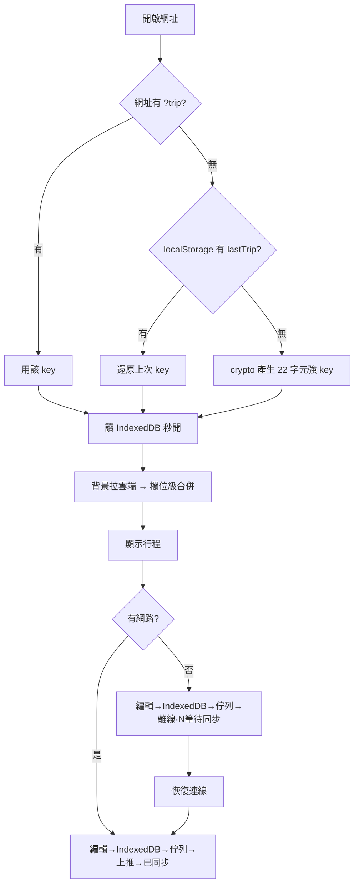
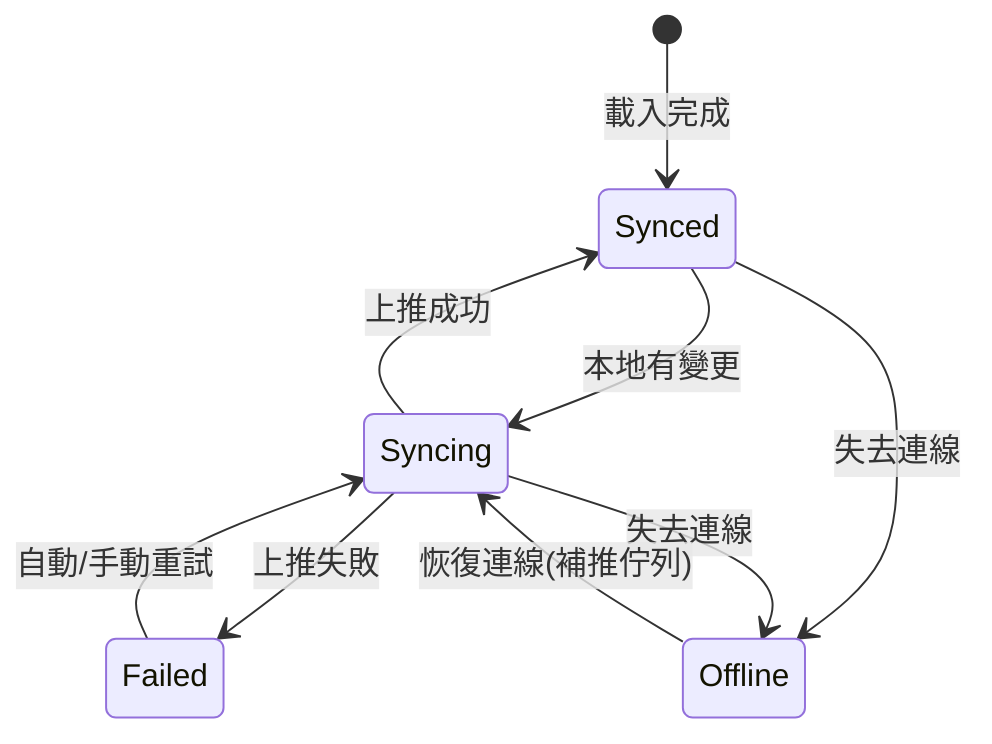
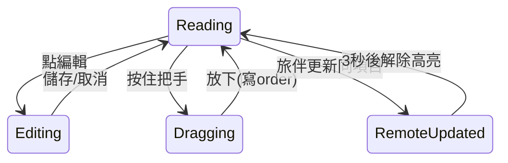

# 櫻旅 Sakura Trip v2 — UI/UX 設計規範

## 1. 概覽

| 項目 | 內容 |
|------|------|
| 對應 PRD | v2.0（[../01-PRD/PRD.md](../01-PRD/PRD.md)）|
| 設計版本 | UI v2.0 |
| 撰寫角色 | UI/UX 設計師 |
| 日期 | 2026-06-05 |
| 涵蓋範圍 | 5 個分頁（行程/帳本/清單/相簿/設定）+ 新增同步狀態列、預算統計、拖曳、打包清單、刪除確認 |
| 交付物 | 本規範 `ui-spec.md` + `prototype.html`（可互動原型）|

### 變更摘要（相對 v1）

| 區塊 | 變更 |
|------|------|
| Header | 🆕 新增**同步狀態列**（C-12）：已同步/同步中/離線/失敗 |
| 行程 | 🆕 行程項目左側**拖曳把手**（F-12）；🆕 刪除改**確認**（F-31 刪除確認）|
| 帳本 | 🆕 **預算進度條**（F-23）+ **分類統計橫條**（F-24）+ 記帳加**分類選擇**（F-22）|
| 清單 | 🆕 第三張卡**行前打包清單**（F-31）含「帶入範本」|
| 設定 | 🆕 **總預算**輸入（F-52）+ **查即時匯率**按鈕（F-25）|

### 設計原則（本專案）

1. **沿用 v1 櫻花粉視覺語言** — PRD 第 9 章硬性約束，維持品牌一致（見 DDR-01）
2. **手機優先、單欄、底部 5 tab** — 拇指可達
3. **3 秒理解** — 每畫面狀態（同步/離線/超支）用顏色 + 文字雙編碼
4. **44px 觸控目標無例外** — 含拖曳把手與刪除鈕

---

## 2. 設計 Tokens

> 沿用 v1 既有色票（Tailwind rose/pink 系），補齊語意色與間距系統。所有數值走 Token，禁止魔術數字。

### 2.1 色彩

| Token | 值 | 用途 |
|-------|-----|------|
| `--c-primary` | `#fb7185` (rose-400) | 主題色、主按鈕、Dn 標記 |
| `--c-primary-hover` | `#f43f5e` (rose-500) | 主按鈕 hover、標題文字 |
| `--c-accent` | `#c084fc` (purple-400) | AI 查詢類動作 |
| `--c-bg-grad` | `pink-50 → rose-50 → pink-100` | 全頁背景漸層 |
| `--c-surface` | `rgba(255,255,255,.8)` | 卡片底 |
| `--c-field` | `#fdf2f8` (pink-50) | 輸入框底 |
| `--c-border` | `#fce7f3` (pink-100) | 邊框 |

### 2.2 語意色（狀態雙編碼）

| 語意 | 色 | 用於 |
|------|-----|------|
| 成功/已同步 | `#34d399` (emerald-400) | 同步點、達成 |
| 進行中 | `#fbbf24` (amber-400) | 同步中、估算待確認、離線待同步 |
| 警示/失敗/超支 | `#f43f5e` (rose-500) | 同步失敗、預算超支、刪除確認 |
| 中性 | `#cbd5e1` (slate-300) | 停用、次要 |

### 2.3 行程類型色（沿用 v1）

| 類型 | 色票 |
|------|------|
| 景點 spot | `purple-100/600` |
| 美食 food | `amber-100/600` |
| 購物 shop | `pink-100/600` |
| 交通 move | `sky-100/600` |
| 住宿 stay | `rose-100/600` |
| 其他 other | `gray-100/500` |

### 2.4 字級（rem，基準 16px）

| Token | 值 | 用途 |
|-------|-----|------|
| `--t-h1` | 1.125rem / 700 | App 標題 |
| `--t-h2` | 1rem / 700 | 區塊標題 |
| `--t-body` | 0.875rem | 內文、項目 |
| `--t-cap` | 0.75rem | 說明、meta |
| `--t-micro` | 0.6875rem (11px) | tab 標籤、tag |

### 2.5 間距（4pt 基數）

| Token | px | 常見用途 |
|-------|-----|---------|
| `--sp-1` | 4 | icon-文字間隙 |
| `--sp-2` | 8 | 元件內間距、gap |
| `--sp-3` | 12 | 卡片內 padding（緊湊）|
| `--sp-4` | 16 | 卡片 padding、頁面邊距 |
| `--sp-6` | 24 | 區塊間距 |

### 2.6 圓角 / 陰影 / 動畫

| Token | 值 |
|-------|-----|
| `--r-card` | 1rem (2xl) |
| `--r-field` | 0.75rem (xl) |
| `--r-pill` | 9999px |
| `--shadow-card` | `0 1px 2px rgba(0,0,0,.05)` |
| `--ease` | `cubic-bezier(.2,.8,.2,1)` |
| `--dur` | 180ms（一般）/ 240ms（拖曳放下）|

---

## 3. 頁面清單

| 編號 | 頁面 | 路由 | 對應 PRD | 優先 |
|------|------|------|----------|------|
| P-01 | 行程 Trip | tab=trip | F-10~14, F-01~05 | 🔴 |
| P-02 | 帳本 Money | tab=money | F-20~25 | 🔴 |
| P-03 | 清單 Lists | tab=lists | F-30~31 | 🟡 |
| P-04 | 相簿 Album | tab=album | F-40 | 🟢 |
| P-05 | 設定 Setting | tab=setting | F-50~52, F-06 | 🟡 |

> 路由維持 v1 的 tab state + `?trip=` query，無前端 router。

---

## 4. 元件清單

| 編號 | 元件 | 類型 | 對應 |
|------|------|------|------|
| C-01 | Card | P | 容器卡 |
| C-02 | SectionTitle | P | 區塊標題 |
| C-03 | PinkBtn | P | 主按鈕 |
| C-04 | Field | P | 輸入框 |
| C-05 | BottomNav | P | 底部 5 tab |
| C-06 | FlightCard | C | 航班管理（F-13）|
| C-07 | DayCard | C | 每日卡（F-11/12）|
| C-08 | ItemRow | P | 行程項目列（+ 拖曳把手）|
| C-09 | ChecklistCard | C | 清單卡（食/購/打包）|
| C-10 | ExpenseForm | C | 記帳表單（+ 分類）|
| C-11 | SettleCard | P | 結算卡 |
| **C-12** 🆕 | SyncStatusBadge | P | 同步狀態徽章（F-04）|
| **C-13** 🆕 | BudgetBar | P | 預算進度條（F-23）|
| **C-14** 🆕 | CategoryStats | P | 分類統計橫條（F-24）|
| **C-15** 🆕 | DragHandle | P | 拖曳把手（F-12）|
| **C-16** 🆕 | ConfirmSheet | P | 刪除確認底部彈窗（F-31 刪除確認）|
| **C-17** 🆕 | OfflineBanner | P | 離線提示條 |

---

## 5. 使用者流程圖

---

## 6. 頁面詳細規格

### P-00 全域框架

| 區 | 規格 |
|----|------|
| Header（sticky）| 🌸 + 旅程名稱（truncate）+ **C-12 同步徽章** + 旅伴數。高 ≈ 52px |
| Main | `max-w-2xl` 置中，左右 `--sp-4`，底部留 96px 給 nav |
| BottomNav（fixed）| 5 tab，每個 ≥ 44px 高，active=rose-400 |
| OfflineBanner（C-17）| 離線時於 Header 下方滑入一條 amber 細條：「📴 離線中・N 筆待同步」|

### P-01 行程 Trip

| 區塊 | 規格 | 狀態 |
|------|------|------|
| 旅程日期卡 | 出發/回程 date + 「產生/補齊每日卡片」按鈕（沿用 v1）| — |
| 航班卡 C-06 | 沿用 v1，AI 查時刻 | S-展開表單 / S-編輯 |
| 每日卡 C-07 | Dn 徽章 + 日期 + 城市/住宿輸入 + 項目列表 | S-空（提示）/ S-有項目 |
| 項目列 C-08 | **左側拖曳把手 C-15** + 類型 tag + 時間 + 標題 + 備註 + 地圖/編輯/刪除 | S-閱讀 / S-編輯內嵌表單 / S-拖曳中 / S-剛被旅伴更新（⚠ 3 秒高亮）|

**拖曳規格（F-12）**
| 項目 | 規格 |
|------|------|
| 觸發 | 按住把手 C-15（≥150ms）進入拖曳 |
| 視覺 | 被拖列上浮（shadow 加深 + scale 1.02）；落點顯示 rose-200 占位線 |
| 規則 | 拖放後寫入 `order`，該日改以 order 排序（DDR-04）|
| 動畫 | 放下 240ms ease 歸位 |

**刪除確認（F-31 刪除確認）**：點刪除 → C-16 底部彈出「確定刪除『XXX』？」+ 取消/刪除（rose-500）。

### P-02 帳本 Money

| 區塊 | 規格 |
|------|------|
| 總覽卡 | 日幣花費 / 台幣花費（沿用）+ 加號展開 C-10 記帳表單 |
| **C-13 預算進度條** 🆕 | 「已花 ¥X / 預算 ¥Y」+ 進度條：≤80% emerald、80~100% amber、>100% rose-500 並顯示「超支 ¥Z」。未設預算則隱藏 |
| **C-14 分類統計** 🆕 | 6 類（吃/住/交通/購物/門票/其他）橫條，按 JPY 佔比；顯示金額 + 百分比。各類用對應類型色 |
| C-10 記帳表單 | 沿用 v1 欄位 + 🆕**分類 pills**（單選，預設其他）|
| 結算卡 C-11 | 沿用 v1（誰付誰、換算）|
| 明細 | 沿用 v1，每列加分類小 tag |

### P-03 清單 Lists

| 卡 | 內容 |
|----|------|
| 美食清單 C-09 | 沿用 v1（可開地圖）|
| 待購清單 C-09 | 沿用 v1 |
| **打包清單 C-09** 🆕 | 無 meta、無地圖；頂部「帶入範本」按鈕（護照/錢包/手機充電器/萬國變壓器/常備藥/雨具/換洗衣物/盥洗用品…）；可勾選/自訂/刪 |

### P-04 相簿 Album（沿用 v1）

貼共享相簿連結。Phase 2 才做照片上傳，本版維持 v1。

### P-05 設定 Setting

| 區塊 | 規格 |
|------|------|
| 分享連結卡 | 沿用 v1 複製 |
| 旅程設定卡 | 旅程名稱 + 匯率；🆕 **總預算（JPY）輸入**；🆕**「查即時匯率」按鈕**（purple-400，loading 轉圈，成功套用 + toast）|
| 旅伴卡 | 沿用 v1 增刪 |

---

## 7. 互動狀態機

### 同步狀態（C-12）

| 狀態 | 徽章 | 顏色 |
|------|------|------|
| Synced | ● 已同步 | emerald |
| Syncing | ◐ 同步中… | amber（脈衝）|
| Offline | ◌ 離線·N | amber + OfflineBanner |
| Failed | ✕ 失敗·重試 | rose（可點重試）|

### 行程項目（C-08）

---

## 8. 響應式規則

| 斷點 | 寬 | 規格 |
|------|-----|------|
| compact | < 480px | 預設，單欄，主要目標 |
| standard | 480–768px | `max-w-2xl` 置中，留白增加 |
| expanded | > 768px | 內容仍 `max-w-2xl`，兩側留白，不展開多欄（行程本質單欄）|

**跨斷點不變**：底部 nav 永遠 fixed；觸控目標永遠 ≥ 44px。
**iOS Safe Area**：`viewport-fit=cover`（v1 已設）；BottomNav 加 `padding-bottom: env(safe-area-inset-bottom)`；Header 加 `env(safe-area-inset-top)`。

---

## 9. 無障礙規範

| 項目 | 規格 |
|------|------|
| 對比 | 正文 rose-900 on pink-50 ≥ 4.5:1；次要 rose-400 文字僅用於 ≥ caption 且非關鍵唯一資訊 |
| 狀態雙編碼 | 同步/超支不只用顏色，必附文字（「已同步」「超支 ¥Z」），色盲可辨 |
| 觸控 | 拖曳把手、刪除、勾選圓鈕皆 ≥ 44px 命中區（可用透明 padding 擴大）|
| 拖曳替代 | 拖曳非唯一手段：項目編輯表單內提供「上移/下移」按鈕作為無障礙替代（DDR-05）|
| 標籤 | 圖示按鈕加 `aria-label`（地圖/編輯/刪除/拖曳）；同步徽章 `role=status` `aria-live=polite` |
| 動態字級 | 字級用 rem，支援瀏覽器縮放至 200% 不破版 |

---

## 10. 動畫與轉場

| 場景 | 動畫 |
|------|------|
| 表單展開/收合 | height + opacity，180ms ease |
| 拖曳放下 | transform 歸位 240ms ease |
| 同步中徽章 | opacity 脈衝 1s 循環 |
| OfflineBanner | 由上滑入 180ms |
| ConfirmSheet | 由下滑入 + 背景遮罩淡入 180ms |
| RemoteUpdated 高亮 | 背景 amber-50 淡入淡出 共 3s |

**`prefers-reduced-motion: reduce`**：關閉所有位移/縮放/脈衝動畫，改為瞬間切換或單純 opacity ≤ 100ms。

---

## 11. 設計決策記錄（DDR）

| 編號 | 決策 | 理由 |
|------|------|------|
| DDR-01 | 維持 v1 櫻花粉、不改 iOS 系統灰 | PRD 第 9 章硬性約束；品牌延續，且共編對象為親友、粉色調親和 |
| DDR-02 | 同步狀態放 Header 而非獨立頁 | 同步是全域狀態，需隨時可見；放 header 不佔行程空間 |
| DDR-03 | 預算進度條放帳本頂部、未設則隱藏 | 漸進揭露，沒設預算的人不被干擾 |
| DDR-04 | 拖曳後該日改以 order 排序、不再看 time | 避免「拖了卻被 time 拉回去」的衝突；time 仍顯示供參考 |
| DDR-05 | 拖曳提供「上移/下移」按鈕替代 | 無障礙：拖曳對部分使用者/螢幕報讀器不可行 |
| DDR-06 | 刪除一律加 ConfirmSheet | 共編資料誤刪不可復原，且雲端同步會擴散誤刪 |
| DDR-07 | 分類統計用純 CSS 橫條不引圖表庫 | PRD 技術選型：零依賴零成本，效能佳 |
| DDR-08 | 打包清單與食/購共用 ChecklistCard | 結構相同，重用元件降複雜度；差異用 props（無 meta/無地圖/有範本）|

---

## 12. 附錄：元件 ↔ 檔名 ↔ 原型對照

| 元件 | React 檔（v2 拆檔後，見 F-60）| 原型區塊 |
|------|------|----------|
| C-01 Card | `components/Card.jsx` | 全頁 |
| C-05 BottomNav | `components/BottomNav.jsx` | 底部 |
| C-06 FlightCard | `views/trip/FlightCard.jsx` | P-01 |
| C-07 DayCard | `views/trip/DayCard.jsx` | P-01 |
| C-08 ItemRow | `views/trip/ItemRow.jsx` | P-01 |
| C-09 ChecklistCard | `views/lists/ChecklistCard.jsx` | P-03 |
| C-10 ExpenseForm | `views/money/ExpenseForm.jsx` | P-02 |
| C-12 SyncStatusBadge | `components/SyncStatusBadge.jsx` | Header |
| C-13 BudgetBar | `views/money/BudgetBar.jsx` | P-02 |
| C-14 CategoryStats | `views/money/CategoryStats.jsx` | P-02 |
| C-15 DragHandle | `components/DragHandle.jsx` | P-01 |
| C-16 ConfirmSheet | `components/ConfirmSheet.jsx` | 全域 |
| C-17 OfflineBanner | `components/OfflineBanner.jsx` | Header 下 |

> 對應同步/資料層（C-12/C-17 行為）由 `hooks/useTrip.js`、`lib/sync.js`、`lib/db.js` 驅動，詳見開發員 `03-DesignDocs/`。
