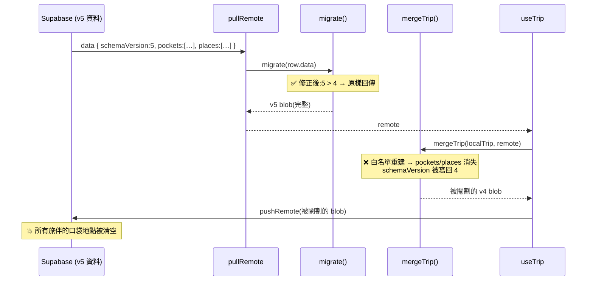
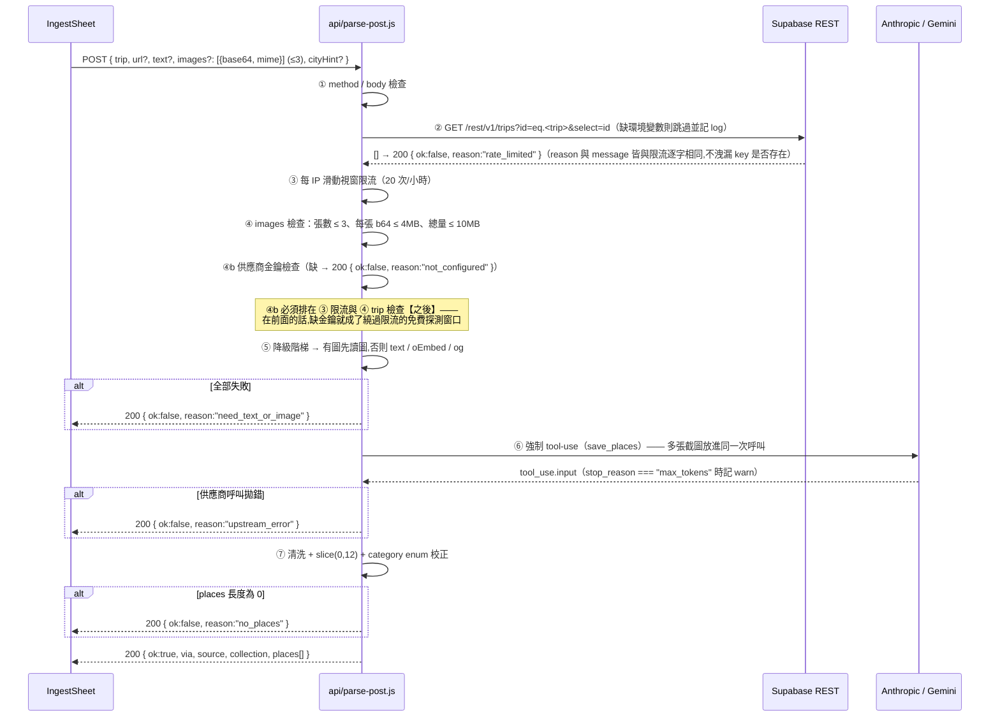

# 後端設計文件 — v3 口袋地點：資料契約（SCHEMA_VERSION 5）+ 貼文解析端點

###### tags: `Backend`, `Supabase`, `Serverless`, `LLM`, `v3`

:::info
功能名稱：v3「口袋地點」後端／資料層（遷移前向相容修正、schema v5、`/api/parse-post`）
版本：**3.2.1**（**2026-09-04 依 PRD v3.10 回寫**；前版 3.2.0 依 PRD v3.9、3.1.0 依 PRD v3.7 / UI spec v3.1）
最後更新：2026-09-04
作者：程式開發員
:::

> **v3.1.0 同步摘要（上游變更）**
>
> | # | 變更 | 影響章節 |
> |---|---|---|
> | 1 | `/api/parse-post` 契約由單張 `imageBase64` 改為 **`images?: [{base64, mime}]`，上限 3 張**（PRD §7.5b）| §5.5、§6.1、§6.2、§6.3、§6.5 |
> | 2 | `pocket.rawText` / `pocket.pending` 已由 PRD v3.5 §5.2 正式納入（Q-03 已裁定 A）| §4.2 |
> | 3 | `PLACE_WARN_BYTES = 800_000` 已由 PRD v3.5 §5.3 正式定義（Q-04 已裁定 A）| §4.3 |
> | 4 | **環境變數顧慮撤銷**：`VITE_SUPABASE_URL` / `VITE_SUPABASE_ANON_KEY` 已存在於 Vercel 專案設定，serverless `process.env` 可見（PRD v3.7 §7.4）| §6.1、§6.5、§7 |
> | 5 | F-78 對 IG 的限制裁定「**MVP 不解決**」：截圖不進 jsonb、**不開 Dexie blob 暫存區**（PRD §4.2）| §4.2、§7 |
> | 6 | 新增 **T-99**（OCR 參數實測），與 T-98 同為人工實機驗收 | §7 |

> **v3.2.0 同步摘要（2026-09-03 依 PRD v3.9 回寫）**
>
> 以下五處是 PRD v3.7～v3.9 更新後留在本文件的殘留，已回寫。（當時以 PRD v3.9 為準；**現行唯一準則是 v3.10**，見下方 v3.2.1 摘要。）
>
> | # | 原本寫的 | 現在（PRD v3.9） | 影響章節 |
> |---|---|---|---|
> | 1 | 降級階梯把 `images[]` 排在第 4（og:meta 之下）| **順位 1：有圖必先讀圖**，文字不論長短併進同一次呼叫當補充 | §5.5、§6.2 |
> | 2 | 每張 base64 ≤ **1.4MB**、總量 ≤ **4MB** | 每張 ≤ **4MB**、總量 ≤ **10MB**（PRD §7.5d）| §5.5、§6.1、§6.5、§7 |
> | 3 | 費用以 **1024px / 2.7k tokens 一張**估算 | **1568px / 1568 視覺 tokens 一張，3 張約 USD $0.005**（PRD §7.5d 實測）| §6.1、§6.3 |
> | 4 | 「`ANTHROPIC_API_KEY` — v2 航班功能已設在 Vercel」| **錯誤**。`api/flight.js` 讀的是 `AERODATABOX_KEY`；**Vercel 上沒有 `ANTHROPIC_API_KEY`**，上線前必須手動新增 | §6.1、§7 |
> | 5 | trip key 不存在時回 `rate_limited` 但**配一句不同的訊息** | 兩者的 `reason` **與 `message` 皆須逐字相同**（實作已修，PR `fix/parse-post-review`）| §5.5、§6.5 |
>
> 另有三處實作階段的契約增修，一併記入：**新增 `reason: "not_configured"`**（缺供應商金鑰）、
> **`max_tokens` 2048 → 4096**（見 §6.3 的說明與 [questions.md](../questions.md) Q-12）、
> **`PARSE_MODEL` 拆成 `PARSE_MODEL_ANTHROPIC` / `PARSE_MODEL_GEMINI`**。

> **v3.2.1 同步摘要（2026-09-04 依 PRD v3.10 回寫）**
>
> **上游已由 v3.9 進到 v3.10**：§7.5c 裁定 Q-12（`max_tokens` 2048 → **4096**，並須檢查 `stop_reason`），
> §7.1／§7.4 裁定 Q-13（補 `bad_request` / `not_configured`，並明訂「限流」與「trip 不存在」必須逐字不可區分）。
> 本次把全文的版本引用由 v3.9 對齊到 **v3.10**，並清掉 v3.2.0 回寫時漏掉的四處文件↔實作矛盾。
>
> | # | 位置 | 原本寫的 | 現在（以 main 上的 `api/parse-post.js`／`api/_parse-lib.js` 為準）|
> |---|---|---|---|
> | 1 | §6.3 pseudo-code | `max_tokens: 2048`，且**沒有** `stop_reason` 檢查 | `max_tokens: 4096` + `stop_reason === "max_tokens"` 時 `console.warn`。**這處特別諷刺**：4096 正是 v3.10 §7.5c 裁定的核心數字，同一份文件的 §6.3 說明段（「由 2048 提高到 4096」）與 §6.3 末的模型參數說明都已經寫對，唯獨那段給人照抄的骨架還留著 2048 |
> | 2 | §6.3 pseudo-code | `model: MODEL`（`MODEL = process.env.PARSE_MODEL`）| `modelFor(provider)`：`PARSE_MODEL_ANTHROPIC` / `PARSE_MODEL_GEMINI`，`PARSE_MODEL` 僅為 fallback —— 與同文件 §6.1 的環境變數表一致 |
> | 3 | §6.3 pseudo-code | `MAX_IMAGES_B64_TOTAL` | `MAX_IMAGES_TOTAL_B64`（值 10_000_000 正確，只有名字對不上實作）|
> | 4 | §5.5 pseudo-code、§6.5 錯誤碼表 | 供應商呼叫失敗回 `need_text_or_image`（骨架）／併進 `rate_limited`（表格）| **`upstream_error`**（新增，見 §6.5 說明）|
>
> 另新增：§5.5／§6.1 明寫「金鑰檢查排在限流與 trip 檢查之後」是**硬性順序**，並已有回歸測試鎖住。

> 註：本專案無 NestJS/Prisma。「後端」＝ **Supabase BaaS（Postgres jsonb + Realtime）** ＋ **Vercel Serverless Functions**。
> 合併／遷移邏輯執行在前端，但屬**多客戶端共享契約**，依 v2 慣例統一由本文件管轄（見 [sync-and-apis.md](sync-and-apis.md) §5 前言）。
> 本文件為**增修**，不取代 `sync-and-apis.md` v1.0.0；該文件的 v2 契約全數繼續有效。

## 1. 相關連結

- PRD：[../../01-PRD/PRD-v3-pocket-places.md](../../01-PRD/PRD-v3-pocket-places.md)（**v3.10**，F-69～F-78、F-81、F-83；§2 Phase 0、§5 資料模型、§7 端點規格與 **§7.5b 多張截圖**、**§7.5d OCR 參數實測結果**、§10 測試規則含 **T-99**）
- UI 規範：[../../02-Design/ui-spec-v3-pocket.md](../../02-Design/ui-spec-v3-pocket.md)（**v3.1**，依平台分流、C-30 ShotPicker）
- UI 原型：[../../02-Design/prototype-v3-pocket.html](../../02-Design/prototype-v3-pocket.html)
- 前端設計文件：[../frontend/pocket-v3.md](../frontend/pocket-v3.md)
- v2 既有契約（繼續有效）：[sync-and-apis.md](sync-and-apis.md)
- 交叉比對：[../cross-check-v3.md](../cross-check-v3.md)
- Commit 計畫：[../commits-plan-v3.md](../commits-plan-v3.md)

## 2. 功能概述與目標

- **功能描述**：
  1. **Phase 0（F-69）**：修掉「新版資料被舊版 client 砍欄位再推回雲端」的資料遺失路徑。**此路徑不只在 `migrate.js`，也在 `merge.js`**（見 §5.1，本設計階段新發現）。
  2. **Phase 1 資料契約**：`SCHEMA_VERSION` 4 → 5，trip jsonb 新增 `pockets[]` / `places[]` 兩個 id-keyed list，`days[].items[]` 新增選填 `placeId`。
  3. **Phase 1 端點**：新增 `POST /api/parse-post`，把社群貼文的連結／文字／**最多 3 張截圖**解析成結構化地點清單。**截圖是 Instagram 的唯一內容路徑**（PRD §4.2 T-98 實測），因此順位 4 不是「輔路徑」而是主平台的主路徑。
- **技術目標**：
  - 前向相容一次做到底：任何未來版本新增的欄位，舊 bundle 都必須**原樣穿透**，不得重建物件時丟棄。
  - 新資料完全**寄生在既有同步機制上**：不新增 Dexie store、不新增 Realtime 頻道、不新增 CAS 迴圈、不新增合併函式。
  - 端點沿用 `api/flight.js` 的 **fail-soft**：永遠回 HTTP 200，以 `ok` 欄位表達成敗，讓 `src/lib/api.js` 保持零錯誤處理分支。
  - LLM 供應商可用單一環境變數切換，邊際成本可一鍵歸零。
- **範圍限制**：
  - 本文件**只涵蓋 MVP（PRD §8 的 P1–P10）**。
  - `api/geocode.js`、`geo_cache` 表、Photon／Nominatim、Leaflet（F-84～F-87、F-79、F-80）屬 **Phase 1.5，不在本文件範圍**；但資料模型**預留** `lat` / `lng` / `geoSource` / `photoUrl` 欄位（§4.2）。
  - PWA `share_target`（F-82）屬 Phase 2，不做。

---

## 3. 系統架構與模組劃分

```
Supabase（表結構完全不變,零 DDL）
├── trips 表 (id, data jsonb, writer, updated_at)   # v3 只改 data 的 JSON 約定
├── Realtime publication                            # 沿用
└── RLS "anon all access"                           # 沿用（強 key 為存取邊界）

Vercel Serverless (/api)
├── flight.js        # 既有,不動
├── rate.js          # 既有,不動
├── parse-post.js    # 🆕 貼文 → 地點清單（LLM）
└── _parse-lib.js    # 🆕 純函式（降級階梯判斷、og 解析、結果清洗）;
                     #    底線開頭 → Vercel 不當成路由,可被 vitest 直接 import

共享契約（前端 src/lib/ 實作,本文件管轄）
├── schema.js   # SCHEMA_VERSION 5、DEFAULT、LIST_FIELDS、validateTrip、預算常數
├── migrate.js  # v1→v5 遷移 + 前向相容 early-return（F-69 上半）
└── merge.js    # mergeTrip / mergeList + 未知欄位穿透（F-69 下半,本階段新發現）
```

**模組職責邊界**

| 模組 | 職責 | 明確不做 |
|------|------|---------|
| `schema.js` | 型別預設值、大小／結構驗證、容量常數 | 不含合併邏輯、不含 UI 文案 |
| `migrate.js` | 版本升級（單向、冪等）、未知版本 early-return | 不做去重、不做合併 |
| `merge.js` | 多端合併、未知欄位穿透 | **`places` / `pockets` 不進 `dedupeByContent`**（§5.4） |
| `api/parse-post.js` | HTTP 外殼、防護、降級階梯、供應商切換 | 不寫任何資料庫（純無狀態） |
| `api/_parse-lib.js` | 可測純函式 | 不做 I/O |

---

## 4. 資料庫設計

### 4.1 Supabase 表：**零變更**

```sql
-- 完全沿用 v2。v3 不做任何 DDL。
create table if not exists trips (
  id text primary key,
  data jsonb not null default '{}',
  writer text,
  updated_at timestamptz default now()
);
```

只需在 `supabase-schema.sql` 補上 v5 `data` 內容的註解（與 v2 的 B3 commit 同樣做法，零風險）。
`geo_cache` 表是 **Phase 1.5** 的事，本版**不建立**。

### 4.2 `data` jsonb 結構（v5）

```typescript
interface TripData {
  schemaVersion: 5;                       // ← 4 → 5
  tripName:  Scalar<string>;
  startDate: Scalar<string>;
  endDate:   Scalar<string>;
  rate:      Scalar<number>;
  budgetJPY: Scalar<number>;
  travelers: Scalar<string[]>;
  flights:   Flight[];
  days:      Day[];
  expenses:  Expense[];
  food:      ChecklistItem[];
  shopping:  ChecklistItem[];
  packing:   ChecklistItem[];
  albums:    Album[];
  pockets:   Pocket[];                    // 🆕 v5
  places:    Place[];                     // 🆕 v5
  _v1backup?: unknown;
}

// 🆕 一則收藏的貼文
interface Pocket extends Mergeable {      // Mergeable = { id, updatedAt, _deleted? }
  title:     string;                      // AI 產,15 字內;F-78 待解析時固定為 "待解析"
  sourceUrl: string;                      // "" = 純文字或截圖來源
  platform:  Platform;                    // 來源平台,由後端依 host 判定
  summary:   string;                      // AI 產,30 字內
  createdAt: number;                      // epoch ms,清單排序用（新→舊）
  rawText:   string;                      // 原始貼文文字。F-78 待解析與 S-06 重新解析的預填來源
  pending:   boolean;                     // true = F-78 待解析,回線後可重試
}
type Platform = "instagram" | "threads" | "xiaohongshu" | "tiktok" | "youtube" | "other";

// 🆕 一個抽出的地點
interface Place extends Mergeable {
  pocketId:  string;                      // "" = 手動新增,無來源貼文（UI S-07）
  name:      string;                      // 貼文原文用字
  nameJa:    string;                      // AI 推的日文正式名;推不出來為 ""。MVP 唯讀（DDR-15b）
  category:  ItemType;                    // === ITEM_TYPE_KEYS,零轉換表
  area:      string;                      // 例 "福岡 中洲川端"
  note:      string;                      // 60 字內
  lat:       number | null;               // 預留 Phase 1.5,MVP 恆為 null
  lng:       number | null;               // 預留 Phase 1.5,MVP 恆為 null
  geoSource: "" | "photon" | "nominatim" | "manual";  // 預留,MVP 恆為 ""
  photoUrl:  string;                      // 預留（Supabase Storage）。硬性:只存 URL,永不存 bytes
  order:     number;
}

// 既有 DayItem 新增一個選填欄（其餘不變）
interface DayItem extends Mergeable {
  time: string; title: string; type: ItemType; note: string; order: number;
  mapUrl?: string;
  placeId?: string;                       // 🆕 從口袋加入時寫入;手動新增為 "" / undefined
}
```

> **`Place` 沒有 `usedIn`。** 「已加入哪幾天」一律由 `days[].items[].placeId` **反查**（`daysForPlace()`）。
> 理由：同一家店可排多天；兩人排到不同天不會互蓋；`mergeList` 的整筆 LWW 不可能弄丟「加入行程」狀態。

> **`placeId` 是普通字串欄位**，掛在 item 上，吃既有 `mergeList`（item 整筆 LWW）。
> **不得**為它擴充 `mergeDays` —— `mergeDays` 目前只對 `city` / `lodging` / `lodgingMap` 三個純量做欄位級處理，加東西等於動已通過 SA 的同步核心。

#### ✅ `rawText` / `pending`：PRD v3.5 §5.2 已正式納入（原 Q-03，裁定選項 A）

| 欄位 | 為什麼非要不可 | 現況 |
|------|---------------|------|
| `pocket.rawText` | F-78「離線暫存待解析」必須把使用者原本貼的**貼文文字**存下來，否則回線後 UI 的「重新解析」按鈕沒有東西可送。`sourceUrl` 只能存連結，存不了 caption | ✅ PRD v3.5 §5.2 已定義，且 §4.2 F-78 明寫「以 `rawText` + `sourceUrl` 預填重跑解析」 |
| `pocket.pending` | S-06「待解析」卡片需要一個明確狀態旗標。用 `title === "待解析"` 當旗標是字串比對，使用者一改標題就壞掉 | ✅ PRD v3.5 §5.2 已定義 |

兩者皆為純字串／布林，合計約 +8B/筆，對 §5.5 的容量評估無實質影響。

> #### ⚠ F-78 對 Instagram 的已知限制（PRD v3.7 裁定：**MVP 不解決**）
>
> 截圖**不得**寫進 trip jsonb（PRD §5.5 硬性規定），所以離線時能存下來的只有 `sourceUrl` 與 `rawText`。
> 對 IG 而言，離線收藏一則貼文，回線後**仍需重新截一次圖**。
>
> **本設計不得規劃任何 blob 暫存機制**（Dexie 另開 image store、生命週期與清理策略等），
> 技術總監已裁定不值得：能滑到一支 IG Reel 就代表有連線，「離線 + IG + 想收藏」近乎不存在。
> 唯一要做的是**誠實標示**：離線橫幅追加警語（UI §6.1.5）＋ S-06b 按鈕文案「補一張截圖再解析」。

### 4.3 容量常數（`schema.js`）

| 常數 | 值 | 用途 | 出處 |
|------|----|------|------|
| `MAX_JSON_BYTES` | `1_000_000` | 既有硬上限（`validateTrip`） | v2 |
| `PLACE_BUDGET_BYTES` | `900_000` | F-76 寫入前試算，超過即擋 | PRD §4.2 F-76 |
| `PLACE_WARN_BYTES` | `800_000` | P-06 常駐預警條（80 萬黃字預警、90 萬才擋） | ✅ **PRD v3.5 §5.3 已正式定義**（原 Q-04，裁定選項 A）|

> 兩個門檻**必須以具名常數引用**，元件內不得寫死數字（UI spec §6.4 硬性）。

### 4.4 `validateTrip` 的兩處修改

```js
const LIST_FIELDS = [
  "flights", "days", "expenses", "food", "shopping", "packing", "albums",
  "pockets", "places",                    // 🆕 每筆必須有 string id（T-75）
];

export function validateTrip(data) {
  if (!data || typeof data !== "object") return { ok: false, reason: "資料格式錯誤" };
  // 🆕 把「資料比我新」與「資料比我舊」分開報，讓 F-77 能給出可行動的指示
  if (data.schemaVersion > SCHEMA_VERSION)
    return { ok: false, reason: "App 版本過舊,請重新整理頁面" };
  if (data.schemaVersion !== SCHEMA_VERSION) return { ok: false, reason: "資料版本不符" };
  /* …其餘不變… */
}
```

**為什麼「比我新」要 fail-closed（拒推）而不是放行**：
舊 bundle 對 v5 欄位的語意一無所知，讓它繼續推送等於用一個不理解資料的程式當寫入者。擋下來 + 由 F-77 顯示「請重新整理頁面」，是唯一**可行動**且**零資料風險**的處理。代價是該裝置在重新整理前變成唯讀（本地編輯仍留在 IndexedDB，不會消失）。

---

## 5. 核心服務邏輯設計

### 5.1 🔴 F-69：資料遺失路徑有**兩條**，PRD 只寫了一條

PRD §2 只點名 `migrate.js:23`。實作前逐行核對後確認 **`merge.js:166-189` 的 `mergeTrip` 是同一個 bug 的第二個入口，而且它比 `migrate` 更致命**——`migrate` 只在載入時跑一次，`mergeTrip` 在**每一次 pull、每一次 Realtime 推送、每一次 push 前**都會跑。

```js
// merge.js:169-188（現況）
return normalizeTrip({
  schemaVersion: SCHEMA_VERSION,   // ← 強制降版號
  tripName: pick(...), /* …固定 14 個欄位… */
  // ← raw 上的 pockets / places 不在列表裡 → 直接消失
});
```

**完整的資料遺失路徑（v4 bundle 遇到 v5 雲端資料）**



**只修 `migrate.js` 完全擋不住這條路徑。** F-69 必須同時修兩個檔案。

#### 5.1.1 `migrate.js` 修正

```js
export function migrate(raw) {
  if (!raw || typeof raw !== "object") return null;
  if (raw.schemaVersion === SCHEMA_VERSION) return raw;
  // 🆕 F-69: 比我新的資料一律原樣回傳,一個位元都不要碰。
  // 這一行讓所有「未來版本」對所有「已上線版本」自動向前相容。
  if (typeof raw.schemaVersion === "number" && raw.schemaVersion > SCHEMA_VERSION) return raw;

  const fromV1 = !raw.schemaVersion;
  const backup = fromV1 ? structuredClone(raw) : raw._v1backup;

  const normalized = {
    ...raw,                          // 🆕 F-69: 未知欄位一律穿透
    schemaVersion: SCHEMA_VERSION,
    tripName: wrapScalar(raw.tripName, ""),
    /* …既有 13 個欄位一字不改… */
    pockets: (raw.pockets ?? []).map(stamp),   // 🆕 v5
    places:  (raw.places  ?? []).map(stamp),   // 🆕 v5
    ...(backup ? { _v1backup: backup } : {}),
  };
  return normalized;
}
```

#### 5.1.2 `merge.js` 修正（PRD 未列，本設計新增）

```js
// v5 之後,mergeTrip 認得的欄位集合。任何不在這裡的鍵都是「未來版本的欄位」,
// 一律原樣穿透,絕不因為本 bundle 看不懂就丟掉（F-69）。
const KNOWN_TRIP_KEYS = new Set([
  "schemaVersion", "tripName", "startDate", "endDate", "rate", "budgetJPY",
  "travelers", "flights", "days", "expenses", "food", "shopping", "packing",
  "albums", "pockets", "places", "_v1backup",
]);

function passthrough(local, remote) {
  const out = {};
  // local 先、remote 後 → 兩邊都有時採用雲端版本(較可能是最新的);
  // 只有 local 有時仍保留,不會因為對端還沒收到就被抹掉。
  for (const src of [local, remote]) {
    if (!src) continue;
    for (const k of Object.keys(src)) {
      if (!KNOWN_TRIP_KEYS.has(k) && src[k] !== undefined) out[k] = src[k];
    }
  }
  return out;
}

export function mergeTrip(local, remote) {
  if (!remote) return normalizeTrip(local);
  if (!local) return normalizeTrip(remote);
  return normalizeTrip({
    ...passthrough(local, remote),                       // 🆕 未知欄位穿透
    // 🆕 不得降版號。舊 bundle 抱著新版資料時,由 validateTrip 擋下推送(§4.4)
    schemaVersion: Math.max(
      Number(local.schemaVersion) || 0,
      Number(remote.schemaVersion) || 0,
      SCHEMA_VERSION
    ),
    tripName: pick(local.tripName, remote.tripName),
    /* …既有欄位一字不改… */
    pockets: mergeList(local.pockets, remote.pockets),   // 🆕 v5
    places:  mergeList(local.places,  remote.places),    // 🆕 v5
    ...(local._v1backup || remote._v1backup
      ? { _v1backup: local._v1backup || remote._v1backup } : {}),
  });
}
```

> `passthrough` 只在 **本 bundle 不認得的鍵** 上生效。v5 client 認得 `pockets` / `places`，走的是 `mergeList` 正常合併，`passthrough` 永遠碰不到它們——所以這個機制不會削弱任何合併語意。

#### 5.1.3 冪等性與收斂性論證

| 性質 | 論證 |
|------|------|
| `migrate` 冪等 | `migrate(x)` 產生 `schemaVersion === 5`；第二次呼叫命中 `=== SCHEMA_VERSION` early-return，原樣回傳。故 `migrate(migrate(x)) === migrate(x)`（T-72）|
| `migrate` 對未知版本冪等 | `v > 5` 走 early-return，`migrate(migrate(x)) === x`（T-71）|
| `...raw` 不破壞既有欄位 | 展開順序為 `...raw` 在前、具名欄位在後，13 個既有欄位一律被具名值覆蓋，行為與 v2 完全相同。唯一差異是「原本會被丟掉的鍵現在留著」|
| `passthrough` 冪等 | `mergeTrip(a, a)`：兩次迴圈寫入同一組值 → 結果等於 `a` 的未知欄位。`schemaVersion` 取 max 亦冪等 |
| `passthrough` 收斂 | 規則是「remote 覆蓋 local」，在 `pushRemote` 的 read-merge-write（CAS）之下，兩端最終都會以同一份雲端資料為 remote，故收斂。**注意這一項不具交換性**（`mergeTrip(a,b) ≠ mergeTrip(b,a)` 對未知欄位而言），這是刻意的取捨：對看不懂的欄位，「相信雲端」比「相信本地」安全 |
| `mergeList(pockets/places)` | 完全沿用既有 `mergeList`，其冪等／交換性已由 v2 測試覆蓋 |

#### 5.1.4 上線閘門（PRD §2.4，實作時不得跳過）

> **F-69 的兩個檔案修正上線、且確認所有裝置都已載入新 bundle 之前，`SCHEMA_VERSION` 不得升到 5。**
> `vite-plugin-pwa` 用 `registerType: "autoUpdate"`，舊 bundle 可能存活數分鐘到數天。
> 驗證方式：各裝置重新整理後確認版本，或等待一個完整使用週期。
> 對應 commit 計畫：`feature/schema-forward-compat` 分支**單獨上線並確認傳播完成**，才可合併 `feature/pocket-places-frontend` 的 F1。

### 5.2 `places` / `pockets` 刻意**不**進 `normalizeTrip` 的 `dedupeByContent`

`normalizeTrip` 目前對 `flights` / `food` / `shopping` / `packing` / `albums` 做內容去重。**`places` 與 `pockets` 不加入**，且必須在程式碼留下註解：

```js
// places / pockets 刻意「不」做 dedupeByContent（PRD §5.4①）。
// 內容去重在每一次 merge 都會跑,誤判就是永久資料遺失 —— 兩家不同分店的一蘭,
// 只要 area 寫得潦草就會被靜默合併掉。重複偵測改放在 F-72 覆核步驟
// (lib/places.js 的 dedupeAgainstSaved),那裡是「標示 + 預設不勾」,
// 人看得到、可以否決,誤判的代價只是多點一下,而不是資料消失。
```

實作上「不加入」＝ `normalizeTrip` 完全不碰這兩個欄位，由 `...t` 原樣帶過。

### 5.3 `places` 的精簡 tombstone

```js
// useTrip.deletePlace —— 不用通用 listDelete
deletePlace: (id) => commit({
  ...d(),
  places: d().places.map((x) =>
    x.id === id ? { id, _deleted: true, updatedAt: now() } : x),
}),
```

| 項目 | 通用 `listDelete` | 精簡 tombstone |
|------|------------------|---------------|
| 內容 | 整筆記錄攤平 + `_deleted` | 只有 `{ id, _deleted, updatedAt }` |
| 大小 | ≈ 377 B | ≈ 58 B（**省 6.5 倍**）|

**為什麼在 `pick()` 之下安全（逐條對照 `merge.js:30-39`）**

| `pick()` 的判斷 | 精簡 tombstone 的行為 |
|----------------|---------------------|
| `if (ts(b) > ts(a)) return b` | tombstone 的 `updatedAt = now()`，**嚴格大於**被它取代的那筆記錄的 `updatedAt`（同一裝置、同一時間軸），故刪除必勝 ✅ |
| 平手時 `_deleted` 優先 | tombstone 有 `_deleted: true` → 平手也贏 ✅（這正是 v2 為了「刪除不得因平手而失效」加的規則）|
| 回傳的是**整個物件**，不是欄位合併 | 所以「欄位被砍掉」不構成問題——沒有任何程式會去讀一個 tombstone 的欄位，`liveItems()` 在渲染前就過濾掉了 ✅ |
| 對端較新的編輯會復活整筆 | 與通用 `listDelete` 語意**完全相同**（v2 既有行為：edit-after-delete 復活），非本設計引入的新風險 ✅ |
| `mergeList` 要求 `x.id != null` | tombstone 有 `id` ✅ |
| `validateTrip` 要求 `typeof x.id === "string"` | tombstone 有 string `id` ✅（T-75）|

**唯一需要注意的副作用**：離線裝置回線後若帶著同一筆 place 的舊編輯（`updatedAt` 較小），刪除維持有效（T-74）。

### 5.4 `deletePocket` 的連帶處理

刪除一則貼文卡片時，必須在**同一次 commit** 內把該 pocket 底下的 places 一併下 tombstone，否則會留下 `pocketId` 指向已刪 pocket 的孤兒地點（UI 上永遠顯示不出來，卻繼續佔空間）。

```js
deletePocket: (pocketId) => {
  const t = now();
  commit({
    ...d(),
    pockets: d().pockets.map((p) => (p.id === pocketId ? { id: p.id, _deleted: true, updatedAt: t } : p)),
    places:  d().places.map((x) => (x.pocketId === pocketId && !x._deleted
      ? { id: x.id, _deleted: true, updatedAt: t } : x)),
  });
}
```

> **已寫進行程的項目不受影響**：`days[].items[]` 是獨立記錄，只是帶著一個現在指不到東西的 `placeId`。這是正確行為——刪掉靈感來源不該連帶刪掉已排定的行程。`daysForPlace()` 只被口袋頁用來反查 badge，place 都不在了自然也不會渲染。

### 5.5 `/api/parse-post` 主流程



**pseudo-code（骨架）**

```js
const PROVIDER = process.env.PARSE_PROVIDER || "anthropic";
// 一個供應商一個覆寫變數（§6.1）。`PARSE_MODEL` 原本兩家共用,切到 gemini 時
// 忘了改就會把 claude 的模型字串送給 Google,收到看不出原因的 404;保留為 fallback。
const MODEL_DEFAULTS = { anthropic: "claude-haiku-4-5", gemini: "gemini-2.0-flash" };
const modelFor = (provider) =>
  (provider === "gemini" ? process.env.PARSE_MODEL_GEMINI : process.env.PARSE_MODEL_ANTHROPIC)
  || process.env.PARSE_MODEL
  || MODEL_DEFAULTS[provider] || MODEL_DEFAULTS.anthropic;
const MAX_PLACES = 12;
const MAX_IMAGES = 3;                      // PRD §7.5b:張數上限
const MAX_IMAGE_B64 = 4_000_000;           // 每張（PRD v3.10 §7.5d;API 實際允許 10MB/張）
const MAX_IMAGES_TOTAL_B64 = 10_000_000;   // 總量（API 實際允許 32MB/請求）
const RATE_LIMIT = { max: 20, windowMs: 3_600_000 };
const hits = new Map();                    // IP → number[]（冷啟動會重置,已知且接受）

export default async function handler(req, res) {
  const fail = (reason, message) => res.status(200).json({ ok: false, reason, message });
  if (req.method !== "POST") return fail("bad_request", "請用 POST");

  const { trip, url = "", text = "", images = [], cityHint = "" } = req.body || {};
  if (!trip) return fail("bad_request", "缺少行程代碼");

  // PRD §7.5b / §7.4:三道圖片上限,任何一道不過即 too_large。
  const shots = Array.isArray(images) ? images.filter((i) => i && typeof i.base64 === "string" && i.base64) : [];
  if (shots.length > MAX_IMAGES)
    return fail("too_large", "一次最多 3 張截圖,請移除幾張再試。");
  if (shots.some((i) => i.base64.length > MAX_IMAGE_B64))
    return fail("too_large", "有一張截圖太大了,換一張或改貼文字。");
  if (shots.reduce((n, i) => n + i.base64.length, 0) > MAX_IMAGES_TOTAL_B64)
    return fail("too_large", "這幾張截圖加起來太大了,移除一張再試。");

  // 限流與「trip 不存在」必須回【同一個 reason 且同一段 message】—— 見本節末說明。
  const THROTTLED = "剛剛解析太多次了,等一下再試。你貼的內容還留著。";
  if (!withinRateLimit(clientIp(req))) return fail("rate_limited", THROTTLED);
  if (!(await tripExists(trip))) {
    console.warn(`[parse-post] refused: unknown trip key ${trip}`);   // 真正的原因只進 log
    return fail("rate_limited", THROTTLED);
  }

  // 缺金鑰要壞得明顯,不能混進 rate_limited（§6.1 環境變數表）。
  const missingKey = missingProviderKey(PROVIDER);
  if (missingKey) {
    console.error(`[parse-post] ${missingKey} is not set`);
    return fail("not_configured", "解析服務尚未設定金鑰,請聯絡管理者。");
  }

  const ladder = await resolveSource({ url, text, images: shots });   // §6.2
  if (!ladder) return fail("need_text_or_image",
    "這個連結讀不到內文(IG 一定是這樣)。請截一張把說明文字展開的圖,或把寫店名的那段文字貼上來。");

  let raw;
  try {
    raw = PROVIDER === "gemini"
      ? await callGemini(ladder, cityHint)
      : await callAnthropic(ladder, cityHint);
  } catch (e) {
    // 供應商錯誤有自己的 reason,不併進 rate_limited（本節末說明）。
    console.error("[parse-post] provider", PROVIDER, e?.message || e);
    return fail("upstream_error", "解析服務暫時不通,等一下再試。你貼的內容還留著。");
  }

  const places = clampPlaces(raw.places);              // §6.4,純函式,可測
  if (!places.length) return fail("no_places",
    "這段內容裡我找不到具體的店名或景點。再多貼一點文字試試,或直接自己新增。");

  return res.status(200).json({
    ok: true,
    via: ladder.via,
    source: { platform: platformOf(url), url },
    collection: { title: (raw.title || "").slice(0, 15), summary: (raw.summary || "").slice(0, 30) },  // 15 / 30,與 PRD §5.2、§7.3 及 tool schema 的字數同源
    places,
  });
}
```

> **trip key 不存在時故意回 `rate_limited` 而非新的 `not_found`**：讓端點不成為「這個 22 字元 key 存不存在」的探測器；同時前端已有 `rate_limited` 的文案，不必新增分支。
>
> **⚠️ 相同的 `reason` 還不夠 —— `message` 也必須逐字相同（2026-09-03 修正）。** 首版實作回的是
> `reason:"rate_limited"` 配上「這份行程找不到,請從行程頁重新開啟。」，而 PRD §7.4 規定
> **前端一律優先顯示後端的 `message`**，於是那句不同的話把 `reason` 想遮的事情原封不動說了出來，
> 端點照樣是存在性探測器。實作上兩條分支共用同一個 `throttled()` 助手（同 reason、同 message、同狀態碼），
> 真正的原因只寫進 `console.warn`。**回歸測試**：`api/__tests__/parse-post.test.js`
> 斷言兩種情況的回應物件 `toEqual` 相等。

---

## 6. API 介面設計

### 6.1 `POST /api/parse-post`

- **Endpoint**：`POST /api/parse-post`
- **Description**：把社群貼文的連結／文字／**最多 3 張截圖**解析成結構化地點清單。
- **費用**：Anthropic `claude-haiku-4-5`（input $1 / output $5 per MTok），約 1¢/次；100 次/月 ≈ **USD $1**。`PARSE_PROVIDER=gemini` 可切到 Gemini Flash 免費層 → **$0**。
  **多張截圖的成本（PRD v3.10 §7.5d 實測值）**：`OCR_MAX = 1568` / `OCR_QUALITY = 0.85` 壓出的 784×1568 截圖為 **1568 視覺 tokens／張**（1568 正好是 `claude-haiku-4-5` 所屬 Standard tier 的上限，再大會被伺服器端縮一次），3 張約 4.7k input tokens ≈ **USD $0.005／次**，仍在每月 $1 的上限內。
- **環境變數**

| 變數 | 必要性 | 說明 |
|------|--------|------|
| `ANTHROPIC_API_KEY` | `PROVIDER=anthropic` 時必要 | ⚠️ **Vercel 上目前沒有這個變數，上線前必須手動新增。**（本文件 v3.1.0 寫「v2 航班功能已設在 Vercel」是**錯的** —— 那指的是 `AERODATABOX_KEY`，`api/flight.js` 讀的是後者。2026-09-03 查 Vercel 環境變數頁，只有 `AERODATABOX_KEY` 與 `VITE_SUPABASE_*`。）|
| `GEMINI_API_KEY` | `PROVIDER=gemini` 時必要 | 免費層。同樣尚未設定 |
| `PARSE_PROVIDER` | 選填，預設 `anthropic` | 一鍵切換供應商 |
| `PARSE_MODEL_ANTHROPIC` | 選填，預設 `claude-haiku-4-5` | 覆寫 Anthropic 模型字串 |
| `PARSE_MODEL_GEMINI` | 選填，預設 `gemini-2.0-flash` | 覆寫 Gemini 模型字串 |
| `PARSE_MODEL` | 選填，**向下相容的 fallback** | 兩個供應商原本共用這一個變數：切到 gemini 時若忘了改，會把 `claude-haiku-4-5` 送給 Google 並收到看不出原因的 404。已拆成上面兩個；本變數保留，僅在對應的專屬變數缺席時生效 |
| `SUPABASE_URL` / `SUPABASE_ANON_KEY` | 選填（缺了只是降級） | trip key 存在性檢查。**PRD v3.7 §7.4 已撤銷原本的顧慮**：`VITE_SUPABASE_URL` / `VITE_SUPABASE_ANON_KEY` 早已存在於 Vercel 專案設定（Production and Preview），而 Vercel 後台的環境變數對 serverless function 的 `process.env` **一律可見**（`VITE_` 前綴只對 Vite 有意義）。**不需新增任何環境變數、無需手動設定。** 讀取鏈見下方 |

> **缺金鑰必須壞得明顯（2026-09-03 新增）**：`new Anthropic()` 由 SDK 內部讀 `process.env`，
> 因此**無法用 grep 程式碼判斷變數有沒有設**，必須在**執行期**檢查。缺少時直接回
> **`reason: "not_configured"`**、訊息「解析服務尚未設定金鑰,請聯絡管理者。」，並 `console.error`
> 點名缺的是哪一個變數。**不得讓它落進 `catch` 變成 `upstream_error`「解析服務暫時不通」**——
> 那會和網路抖動、真的限流混成一團，是最難查的那種故障。檢查點在**呼叫供應商之前**、
> 降級階梯之前（省掉註定白做的外部 fetch），在限流與 trip key 檢查之後（既有防護順序不變）。
> **這個順序本身是硬性的**：金鑰檢查若排到限流前面，一個沒設金鑰的部署上限流就永遠不會生效
> —— 每個請求都在扣額度之前被擋下，額度形同虛設，端點成了免費的探測窗口。
> 2026-09-04 補上回歸測試（`api/__tests__/parse-post.test.js`「關卡順序」）鎖住這個不變量：
> 在此之前把檢查上移**不會讓任何測試變紅**。

**環境變數讀取鏈（硬性寫法）**

```js
// 無前綴的名稱排前面,日後若改用標準命名可無縫接手（PRD v3.7 §7.4）
const SB_URL = process.env.SUPABASE_URL || process.env.VITE_SUPABASE_URL;
const SB_KEY = process.env.SUPABASE_ANON_KEY || process.env.VITE_SUPABASE_ANON_KEY;

// 兩者【任一】缺失 → 跳過 trip key 檢查,只保留 IP 限流,並在 log 留警告。
// 不得因為缺變數就讓端點整個失效(fail-soft)。
async function tripExists(trip) {
  if (!SB_URL || !SB_KEY) {
    console.warn("[parse-post] Supabase env missing; skipping trip key check, rate limit only");
    return true;
  }
  /* …GET /rest/v1/trips?id=eq.<trip>&select=id… */
}
```

#### Request DTO

```typescript
interface ParsePostRequest {
  trip: string;            // 必要。trip key,用於存在性檢查
  url?: string;            // 貼文連結（來源存證;IG 上對解析無貢獻）
  text?: string;           // 貼文文字（Threads／小紅書／YouTube 的主路徑）
  images?: ParseImage[];   // 截圖（Instagram 的唯一路徑）。最多 3 張,PRD §7.5b
  cityHint?: string;       // 該趟行程的城市,協助 AI 補 area。例 "由布院,福岡,那霸"
}
interface ParseImage {
  base64: string;          // 不含 data: 前綴（前端須自行去掉 compressImage 回傳的 data URL 前綴）
  mime: string;            // "image/jpeg"（compressImage 一律輸出 JPEG）
}
```

> **契約變更紀錄（PRD v3.7 §7.5b）**：原契約為單數 `imageBase64?: string` + `mime?: string`。
> 清單型 IG 貼文（「福岡必吃 5 家」——本專案的起始範例）caption 展開後常超過一屏，
> **一張截圖裝不下全部店名**，只收單張會讓最典型的案例失敗。
> `imageBase64` / `mime` **已移除，不保留相容分支**（此端點尚未上線，沒有舊 client 需要相容）。

#### Response (Success)

```typescript
interface ParsePostOk {
  ok: true;
  via: "text" | "oembed" | "og" | "image";
  source: { platform: Platform; url: string };
  collection: { title: string; summary: string };
  places: ParsedPlace[];                       // 0 < length <= 12
}
interface ParsedPlace {
  name: string; nameJa: string;
  category: "spot"|"food"|"shop"|"move"|"stay"|"other";
  area: string; note: string;
  confidence: number;                          // 0..1
}
```

#### Response (Error) — **一律 HTTP 200**

> **前端處理依平台分流（UI spec v3.1 §6.1.3）**：同一個 `reason` 在一般模式走 **S-13**（聚焦貼文文字欄）、
> 在 Instagram 模式走 **S-21**（聚焦 C-30 截圖選擇器）。後端**不需要知道模式**，`reason` 保持單一組。

| 業務情境 | Http Status | `reason` | 前端處理 |
|----------|-------------|----------|------------------------|
| 非 POST / 缺 trip | 200 | `bad_request` | 一般失敗訊息條 → S-13 / S-21 |
| 五個順位全失敗 | 200 | `need_text_or_image` | S-13「這個連結讀不到內文…」／S-21「讀不到，IG 一定是這樣…請截一張把說明文字展開的圖」 |
| LLM 回空陣列 | 200 | `no_places` | S-13「找不到具體的店名或景點…」／S-21「這張圖上找不到店名，多半是截到食物畫面」 |
| 圖片超過上限（張數 / 單張 / 總量） | 200 | `too_large` | 「截圖太大了…」（兩模式同文案）|
| IP 限流 / trip key 不存在 | 200 | `rate_limited` | 「剛剛解析太多次了…你貼的內容還留著」（兩模式同文案）。**兩者的 `reason` 與 `message` 逐字相同**，見 §5.5 |
| 缺供應商金鑰（`ANTHROPIC_API_KEY` / `GEMINI_API_KEY` 未設定） | 200 | `not_configured` | 「解析服務尚未設定金鑰，請聯絡管理者。」走「未知 reason 原樣顯示」的既有分支 |
| **供應商呼叫失敗**（網路、429、SDK 例外） | 200 | `upstream_error` | 「解析服務暫時不通，等一下再試。你貼的內容還留著。」走「未知 reason 原樣顯示」的既有分支 |

> **沒有任何情況回 4xx/5xx。** 這讓 `src/lib/api.js` 只需 `res.json()`，與 `lookupFlight` / `lookupRate` 保持同一種呼叫風格。
>
> **`upstream_error` 為什麼要從 `rate_limited` 拆出來（2026-09-04 新增）**：拆之前，`rate_limited`
> 一碼三用 —— 真的限流、trip key 不存在、供應商掛掉 —— 而且配**兩句不同的文案**（前兩者「剛剛解析太多次了」、
> 後者「解析服務暫時不通」）。這正是 Q-13 想根除的型態：一個 reason 承載多種語意，前端與 log 都分不出來。
> **只能拆供應商錯誤這一種**：它發生在 trip 檢查**之後**（見 §5.5 的關卡順序），不論 trip key 存不存在都到不了這裡，
> 因此不洩漏存在性；而「限流」與「trip 不存在」兩者**必須繼續逐字不可區分**（PRD §7.4 硬性），不得比照辦理。
> `upstream_error` **尚未列入 PRD §7.1 的 `reason` 列舉**，已記 [questions.md](../questions.md) **Q-15** 請技術總監補。

### 6.2 降級階梯（`resolveSource`）

> **2026-09-03 依 PRD v3.10 §7.2 回寫。** 本節 v3.1.0 的排序（`images[]` 排第 4、在 og:meta 之下）
> 與 PRD 的「**有圖必先讀圖**」直接矛盾，且矛盾的方向會造成真實故障：使用者上傳了截圖，
> 卻因為 og 僥倖回了一段無關文字而**完全不看圖**。實作（`api/_parse-lib.js`）走的是 PRD 的順序。

| 順位 | 條件 | 動作 | `via` |
|------|------|------|-------|
| **1** | **`images.length >= 1`** | **多模態 LLM 讀圖，N 張（≤3）放進同一個 request、同一次 LLM 呼叫**。使用者填的 `text`（**任何長度**）一併附進同一次呼叫當補充脈絡 | `image` |
| 2 | `text.trim().length >= 40` | 直接餵 LLM | `text` |
| 3 | URL host 屬 YouTube / TikTok | 官方 oEmbed（公開免金鑰）取 `title` + `author_name` → LLM | `oembed` |
| 4 | 其他 URL | 伺服器 `fetch`，正則抽 `og:title` / `og:description`。合併後 < 40 字視為失敗。**Instagram 幾乎必失敗**（機房 IP 撞登入牆），這是預期行為不是 bug | `og` |
| 4.5 | 以上皆空但 `text` 非空（< 40 字）| 仍以這段短文字送 LLM（總比直接失敗好）| `text` |
| 5 | 皆失敗 | `ok:false, reason:"need_text_or_image"` | — |

**`resolveSource` 的回傳型別（含多圖）**

```typescript
type Ladder =
  | { via: "text" | "oembed" | "og"; sourceText: string }
  | { via: "image"; images: ParseImage[]; extraText: string };   // 1..3 張,順序即使用者選取順序
```

> **順位 1 為什麼不切成多次呼叫**：三張截圖是**同一則貼文的連續片段**（caption 上半、下半、字幕），
> 切開送會讓每次呼叫都只看到殘缺的上下文——第 2 張裡的「這家也很推」失去指涉對象，
> 而且會產生三份彼此不知道的 `title` / `summary`，覆核清單得再自己合併去重。
> 一次呼叫讓模型自己在三張圖之間對齊，成本 3 張約 USD $0.005（PRD §7.5d）。
>
> **`text` 與 `images` 同時存在時（v3.1.0 的規則已作廢）**：不再「走 text、截圖不併送」。
> T-98 證明 IG 的 caption 無法複製為文字後，截圖成為本專案主平台唯一可行的內容路徑，
> 把它排在文字之下會出現兩種錯誤：① 有圖卻不看圖；② 使用者只打「一蘭 中洲店」這種
> < 40 字的短提示配 3 張截圖，短文字構不成順位 2、圖又排在後面。
> **新規則單純且不會再錯：有圖就一定讀圖，文字（不論長短）以 `extraText` 併進同一次呼叫當補充。**
> 組裝位置見 §6.3（指示 text block 之後的「使用者另外補充的文字」段）。

**oEmbed 端點**（皆為公開、免金鑰）：
`https://www.youtube.com/oembed?format=json&url=…` ／ `https://www.tiktok.com/oembed?url=…`

**逾時**：所有外部 `fetch` 一律 `AbortSignal.timeout(6000)`，逾時即視為該順位失敗往下走，不讓使用者卡在轉圈圈。

### 6.3 結構化輸出（強制 tool-use）

實作採 **官方 Anthropic SDK**（`@anthropic-ai/sdk`），不用裸 `fetch`；Gemini 分支則走該供應商自己的 REST。

```js
import Anthropic from "@anthropic-ai/sdk";
const client = new Anthropic();          // 讀 ANTHROPIC_API_KEY

const SAVE_PLACES_TOOL = {
  name: "save_places",
  description: "把貼文中提到的、真實存在且能在地圖上找到的店家或景點記錄下來。",
  strict: true,
  input_schema: {
    type: "object",
    additionalProperties: false,
    required: ["title", "summary", "places"],
    properties: {
      title:   { type: "string", description: "貼文主題,繁體中文,15 字內" },
      summary: { type: "string", description: "一句話重點,繁體中文,30 字內" },
      places: {
        type: "array", maxItems: 12,
        items: {
          type: "object",
          additionalProperties: false,
          required: ["name", "nameJa", "category", "area", "note", "confidence"],
          properties: {
            name:       { type: "string", description: "店名/景點名,照貼文原文抄" },
            nameJa:     { type: "string", description: "日文正式名稱;推不出來給空字串" },
            category:   { type: "string", enum: ["spot","food","shop","move","stay","other"] },
            area:       { type: "string", description: "城市/區域,例:福岡 中洲川端" },
            note:       { type: "string", description: "為什麼值得去,60 字內繁體中文" },
            confidence: { type: "number", description: "0-1,名稱抄錄正確的把握" },
          },
        },
      },
    },
  },
};

const MAX_OUTPUT_TOKENS = 4096;   // PRD v3.10 §7.5c 裁定（Q-12）;上界是 12 筆地點,不是圖片張數

const msg = await client.messages.create({
  model: modelFor("anthropic"),                  // PARSE_MODEL_ANTHROPIC || PARSE_MODEL || claude-haiku-4-5
  max_tokens: MAX_OUTPUT_TOKENS,
  temperature: 0,
  system: SYSTEM_PROMPT,
  tools: [SAVE_PLACES_TOOL],
  tool_choice: { type: "tool", name: "save_places" },   // 強制,保證回結構化 JSON
  messages: [{ role: "user", content: userContent }],   // 見下
});
// 上限再高也要知道自己撞到了(PRD v3.10 §7.5c)。被截斷時 tool_use.input 仍是個
// 看起來完整的物件,clampPlaces 照收,沒有這行 log 就完全沒有線索。
if (msg.stop_reason === "max_tokens") {
  console.warn("[parse-post] anthropic hit max_tokens; the place list may be truncated",
    { model: modelFor("anthropic"), max_tokens: MAX_OUTPUT_TOKENS });
}
const block = msg.content.find((b) => b.type === "tool_use");
const raw = block ? block.input : { title: "", summary: "", places: [] };
```

**`userContent` 的兩種形態**

```js
// ① 文字 / oEmbed / og（via: text | oembed | og）
[{ type: "text", text: `${cityHintLine}\n\n以下是貼文內容:\n${sourceText}` }]
```

```js
// ② 截圖(多模態,1..3 張,via: "image") —— PRD §7.5b
// 硬性:每個 image block 前面放一個 text block 標號。多圖時模型必須能指稱「第 2 張」,
// 而 API 的 content 陣列本身不帶編號;不標號時模型容易把三張圖的內容混成一團。
function buildImageContent(images, cityHintLine, extraText = "") {
  const blocks = [];
  images.forEach((img, i) => {
    blocks.push({ type: "text", text: `第 ${i + 1} 張截圖(共 ${images.length} 張):` });
    blocks.push({
      type: "image",
      source: {
        type: "base64",
        media_type: img.mime || "image/jpeg",   // compressImage 一律輸出 image/jpeg
        data: img.base64,                        // 不含 data: 前綴
      },
    });
  });
  // 指示文字放【最後】:圖片先進上下文,指示緊貼在提問位置,是多模態的建議順序。
  blocks.push({
    type: "text",
    text:
      `${cityHintLine}\n\n` +
      `以上 ${images.length} 張截圖是【同一則社群貼文】的連續畫面(例如 caption 的上下半段、或影片字幕),` +
      `不是 ${images.length} 則不同的貼文。請把它們合起來看,整則貼文只產生一組 title / summary,` +
      `並列出其中提到的店名或景點;同一家店在多張圖裡出現時只回一次。` +
      (extraText ? `\n\n使用者另外補充的文字:\n${extraText}` : ""),
  });
  return blocks;
}
```

| 組裝規則 | 理由 |
|---|---|
| 每張圖前加一個「第 N 張截圖（共 M 張）」的 text block | content 陣列不帶編號；標號後模型才能在 `note` 裡正確指稱，也降低把多張圖混成一團的機率 |
| 指示文字放在**所有圖片之後** | 圖片先進上下文、指示緊貼提問位置，是 Anthropic 多模態的建議順序 |
| 指示文字**必須明寫「同一則貼文」** | 不寫的話模型會把 3 張圖當 3 則貼文，回出三組 title 或重複的地點 |
| 同一家店只回一次 | 連續截圖必然重疊（caption 上下半段會有一兩行重複）|
| `media_type` 取 `img.mime \|\| "image/jpeg"` | 前端 `compressImage` 一律輸出 JPEG；`\|\|` 只是防呆 |
| 仍走**強制 tool-use** | 與文字路徑完全相同，`claude-haiku-4-5` 支援 `tool_choice: {type:"tool"}`，不需要為多圖改變輸出約束 |

> **`max_tokens` 由 2048 提高到 4096（2026-09-03 提出，PRD v3.10 §7.5c 已裁定採納）**：PRD v3.9 以前寫「維持 2048 即可」，理由是多張圖增加的是
> **input** tokens——這個理由本身正確，但它量的是錯的那一軸。輸出的上界不是圖片張數，而是
> **12 筆地點 × (`name` / `nameJa` / `area` / `note`)**；以繁中／日文計約 3–4k output tokens，`2048` 落在
> 這個最壞情況之下。被截斷時 `tool_use.input` 仍是個**看起來完整的物件**，`clampPlaces` 照收，
> 使用者只會發現「店比貼文裡少」而沒有任何線索。因此：`max_tokens: 4096`，並在
> `stop_reason === "max_tokens"` 時 `console.warn`。輸出 token 只在真的用到時才計費，餘裕不花錢。
> **PRD v3.10 §7.5c 已裁定採納此修正（Q-12 結案）**，本文件與 PRD 現已一致。

> **多圖的 input token 估算（PRD v3.10 §7.5d）**：1568 視覺 tokens／張（不是 v3.1.0 寫的 2.7k），3 張約 4.7k。

**System prompt 重點**（PRD §7.3）
- 只抽**真實存在、可在地圖上找到**的店家或景點。
- 忽略人名、標籤（hashtag）、廣告詞、與本趟行程無關的其他城市。
- 純風景照、沒有具體地點 → **回空陣列**，不要硬編。
- **名稱照貼文原文抄，不要翻譯、不要補字。**
- `cityHint` 只用來補 `area`，**不得**用來把地點硬塞進那些城市。
- **（v3.1 新增，為截圖主路徑而加）** 讀圖時只抄**畫面上看得見的字**；看不清的字寧可降低 `confidence`
  也不要猜補。這一條直接對應 F-72「覆核從保險變成必經校對」——`confidence` 是覆核清單預設不勾的依據，
  模型硬猜會讓那道防線失效。

**模型參數說明**：`claude-haiku-4-5` 支援 `temperature`（PRD 指定 0）與強制 `tool_choice`；本呼叫不啟用 extended thinking（省成本、本任務不需要）。`max_tokens: 4096`（見上方說明）；模型字串取自 `PARSE_MODEL_ANTHROPIC || PARSE_MODEL || "claude-haiku-4-5"`。

### 6.4 結果清洗（`_parse-lib.js`，純函式，可 vitest 測）

```js
export const ITEM_TYPE_KEYS = ["spot","food","shop","move","stay","other"];

export function clampPlaces(list) {
  if (!Array.isArray(list)) return [];
  return list
    .filter((p) => p && typeof p.name === "string" && p.name.trim())
    .slice(0, 12)                                              // T-78
    .map((p) => ({
      name: String(p.name).trim().slice(0, 60),
      nameJa: String(p.nameJa || "").trim().slice(0, 60),
      category: ITEM_TYPE_KEYS.includes(p.category) ? p.category : "other",
      area: String(p.area || "").trim().slice(0, 40),
      note: String(p.note || "").trim().slice(0, 60),
      confidence: Number.isFinite(+p.confidence)
        ? Math.min(1, Math.max(0, +p.confidence)) : 0.5,
    }));
}
```

`slice(0,12)` 是 schema `maxItems` 之外的**第二道**保險（模型偶爾會超）。

```js
export const MAX_TITLE_LEN = 15;      // PRD §5.2 pocket.title / §7.3 tool schema
export const MAX_SUMMARY_LEN = 30;    // PRD §5.2 pocket.summary / §7.3 tool schema

export const clampCollection = (raw) => ({
  title: String((raw && raw.title) || "").trim().slice(0, MAX_TITLE_LEN) || "收藏的貼文",
  summary: String((raw && raw.summary) || "").trim().slice(0, MAX_SUMMARY_LEN),
});
```

> **15 / 30，不是 30 / 60。** 首版實作截在 30 / 60，是文件值的兩倍，而**同一個檔案的
> `SAVE_PLACES_TOOL` schema 又對模型說「15 字內」「30 字內」**。兩者脫節時，超長標題只有在
> 模型失控時才會出現——最難重現的那種 bug，而口袋卡片的版面是照 15 字排的。
> 三份文件（PRD §5.2／§7.3、本文件、UI spec）與 tool schema 皆為 15 / 30，**以 PRD 為準對齊程式碼**。
> 回歸測試把 tool schema 的字串與這兩個常數綁在一起，日後改一邊會立刻失敗。

### 6.5 端點防護對照表

| 措施 | 實作 | 對應測試 |
|------|------|---------|
| trip key 存在性檢查 | `GET {SB_URL}/rest/v1/trips?id=eq.<key>&select=id`，headers `apikey` + `Authorization: Bearer <SB_KEY>`。空陣列 → 拒絕呼叫 LLM，**回與限流逐字相同的 `reason` 與 `message`**（見 §5.5 末的說明），真正的原因只進 `console.warn`。**`SB_URL` 或 `SB_KEY` 任一缺失 → 跳過此檢查、只留 IP 限流並記 log**（§6.1）| T-79 |
| **供應商金鑰檢查** | 執行期讀 `process.env`（SDK 自己讀 env，grep 程式碼看不出來）：`anthropic` → `ANTHROPIC_API_KEY`、`gemini` → `GEMINI_API_KEY`。缺 → **`reason: "not_configured"`** + `console.error` 點名變數。排在呼叫供應商之前、降級階梯之前 | 新增（`parse-post.test.js`）|
| **金鑰檢查的位置（硬性順序）** | 必須排在**限流與 trip 檢查之後**。上移的話，缺金鑰的部署上限流永遠不會生效，端點成為不必消耗額度、也不需有效 trip key 的免費探測窗口 | 新增（`parse-post.test.js`「關卡順序」三例，2026-09-04）|
| **供應商呼叫失敗** | `catch` → **`reason: "upstream_error"`**（不再併進 `rate_limited`）。此分支在 trip 檢查之後，不洩漏 trip key 存在性 | 新增（`parse-post.test.js`「供應商呼叫失敗」兩例，2026-09-04）|
| 每 IP 滑動視窗限流 | 記憶體 `Map<ip, number[]>`，20 次/小時。冷啟動重置（防護力弱但免費且有摩擦力，PRD 已認可） | — |
| 地點數上限 | schema `maxItems: 12` + `clampPlaces` 的 `slice(0,12)` | T-78 |
| **圖片張數上限** | `images.length > 3` → `too_large` | — |
| **單張圖片上限** | 任一 `images[i].base64.length > 4_000_000` → `too_large`（PRD v3.10 §7.5d；API 實際允許 10MB/張）| — |
| **圖片總量上限** | `sum(base64.length) > 10_000_000` → `too_large`（API 實際允許 32MB/請求）| — |
| 外部 fetch 逾時 | 全部 6 秒 `AbortSignal.timeout` | — |

> **三道圖片上限的順序是刻意的**：先擋張數（最便宜的檢查）、再擋單張、最後才加總。
> 三者都在**呼叫 LLM 之前**，也在 trip key 檢查之前——一個 10MB 的 body 不該先去打 Supabase。
> 前端也會做同一組檢查（frontend §4.6），但後端不得因此省略：前端檢查是體驗，後端檢查是防護。

---

## 7. 注意事項 / 限制 / 備註

| 項目 | 說明 |
|------|------|
| **上線順序是硬性的** | F-69（兩個檔案）→ 確認全裝置傳播 → 才可升 `SCHEMA_VERSION = 5`。違反即重現 PRD §2.2 的雲端層級資料遺失 |
| **`mergeTrip` 的未知欄位穿透不具交換性** | 對未知欄位採「remote 覆蓋 local」。這是刻意取捨（§5.1.3），實作時必須留註解，否則未來會有人「順手修成對稱」而破壞安全性 |
| **舊 bundle 會變成唯讀** | `validateTrip` 對 `schemaVersion > SCHEMA_VERSION` fail-closed。本地編輯留在 IndexedDB 不會消失，重新整理後即恢復。F-77 負責把這件事講清楚 |
| **`_parse-lib.js` 的底線前綴不可省** | Vercel 會把 `api/` 下每個檔案都當成一條路由；`_` 開頭才會被排除 |
| **環境變數：Supabase 那組不需設定，但 `ANTHROPIC_API_KEY` 需要（2026-09-03 修正）** | ⚠️ 原本的「不需要新增任何環境變數」**只對 Supabase 那一組成立**。`ANTHROPIC_API_KEY` **Vercel 上並不存在**（2026-09-03 查證：只有 `AERODATABOX_KEY` 與 `VITE_SUPABASE_*`），本文件 v3.1.0 說「v2 航班功能已設在 Vercel」是把它與 `AERODATABOX_KEY` 搞混了。**上線前必須手動新增**，否則端點會回 `not_configured`。以下為 Supabase 那組的原始結論，仍然有效：**不需要新增任何環境變數、無需手動設定**（PRD v3.7 §7.4 實地查證 Vercel 後台）：`VITE_SUPABASE_URL` / `VITE_SUPABASE_ANON_KEY` 早已存在於 Vercel 專案設定（Production and Preview），且 Vercel 後台變數對 serverless `process.env` 一律可見（`VITE_` 前綴只對 Vite 有意義；同專案 `AERODATABOX_KEY` 即現成佐證）。實作讀取鏈 `process.env.SUPABASE_URL \|\| process.env.VITE_SUPABASE_URL`（KEY 同理），**任一缺失即跳過 trip key 檢查、只留 IP 限流並記 log**，不得因此讓端點整個失效 |
| **`OCR_MAX` / `OCR_QUALITY` 是「IG 能不能用」的參數，不是細節** | 截圖升為 IG 主路徑後，這組常數決定日文小字讀不讀得出來（壓過頭）與會不會撞每張 4MB 上限（壓不夠）。**T-99 已於 2026-09-02 完成**（PRD §7.5d）：定案 `OCR_MAX = 1568` / `OCR_QUALITY = 0.85`，輸出 784×1568、1568 視覺 tokens／張、約 155KB（base64 約 207KB，只用掉單張 10MB 額度的 2%）。**若實作時再調整這兩個常數，須重跑同樣的對照並回寫 PRD §7.5d**。實作時把兩個常數放在 `src/lib/image.js` 具名匯出，不得散落在元件裡，否則調參要改多處 |
| **多張截圖必須同一次 LLM 呼叫** | PRD §7.5b 硬性。切成多次呼叫會切斷同一則貼文的上下文，並產生多組 `title`／重複地點（理由見 §6.2）。實作時 `resolveSource` 回傳的 `images[]` 直接餵給 `buildImageContent()`，不得在迴圈裡逐張呼叫 |
| **`@anthropic-ai/sdk` 只在 serverless 端用** | 它進 `dependencies` 不會被打進前端 bundle（`api/` 由 Vercel 另外建置），但實作後必須確認 `dist/` 大小沒有變化 |
| **IP 限流會被冷啟動重置** | 已知限制。真的被濫用時的下一步是 Supabase Edge Function + 一張計數表，不在本版 |
| **1MB jsonb 上限與購物清單相片共用** | F-76 在 900KB 就擋、F-77 讓牆有說明。`photoUrl` **只能存字串 URL**，任何情況都不得把圖片 bytes 寫進 trip jsonb |
| **Tombstone 增長** | 精簡 tombstone 58B/筆；500 次刪除約 29KB，可接受。90 天壓縮留待 Phase 3 |
| **Phase 1.5 的預留** | `lat` / `lng` / `geoSource` / `photoUrl` 四個欄位在 v5 就存在但恆為 null/""，讓 Phase 1.5 加地圖時**不需要再升一次版號**（也就不需要再走一次 §5.1.4 的閘門）|
