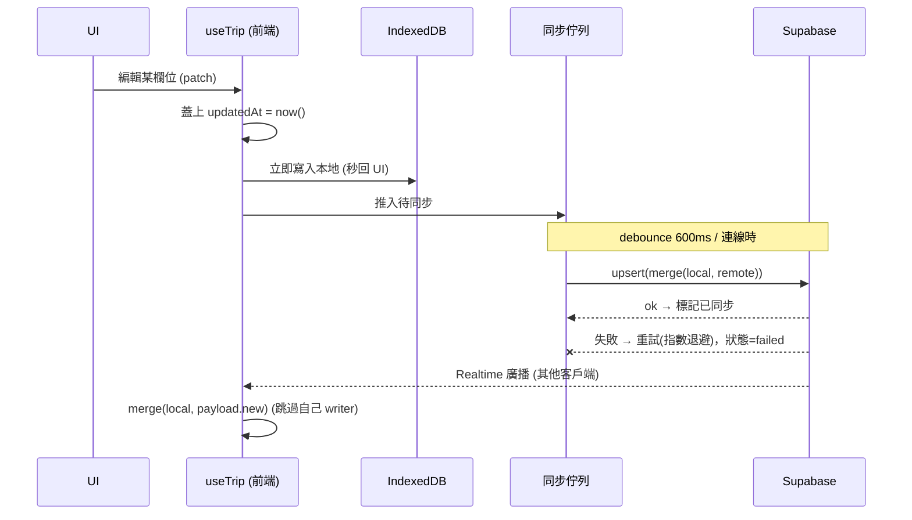

# 後端設計文件 — 同步資料層 + Serverless API

###### tags: `Backend`, `Supabase`, `Serverless`

:::info
功能名稱：v2 同步資料層、衝突合併契約、Serverless API（航班 / 匯率）
版本：1.0.0
最後更新：2026-06-05
作者：程式開發員
:::

> 註：本專案無 NestJS/Prisma。「後端」由兩部分組成：**Supabase BaaS（Postgres jsonb + Realtime）** 與 **Vercel Serverless Functions**。本文件依範本章節結構撰寫，內容對應實際技術棧。資料合併契約放本文件，因為它是前後端共享、雙方都須遵守的 contract。

## 1. 相關連結

- PRD：[../../01-PRD/PRD.md](../../01-PRD/PRD.md)（F-01~07、F-13、F-25、第 5 章資料模型）
- UI 原型：[../../02-Design/prototype.html](../../02-Design/prototype.html)
- 前端設計文件：[../frontend/app-v2.md](../frontend/app-v2.md)

## 2. 功能概述與目標

- **功能描述**：提供 offline-first 共編所需的資料契約：①Supabase `trips` 表的 v2 jsonb 結構；②欄位級衝突合併規則（前後端/多客戶端共用）；③v1→v2 遷移；④Serverless API（航班時刻、即時匯率）。
- **技術目標**：
  - 以「每個可變項目帶 `updatedAt`」的可合併結構，取代 v1 整份 jsonb last-write-wins，杜絕多人覆蓋掉資料。
  - 合併邏輯純函式、可單元測試、冪等。
  - Serverless 端集中金鑰、模型字串可設定。
- **範圍限制**：本版不引入帳號/RLS 權限模型（維持匿名 + 強 key）；相簿 Storage 上傳屬 Phase 2，不在此。

## 3. 系統架構與模組劃分

```
（無 NestJS；以下為實際後端組成）

Supabase
├── trips 表 (Postgres, jsonb)        # 單表，id = 22 字元強 key
├── Realtime publication              # postgres_changes 廣播
└── RLS policy "anon all access"      # 維持匿名（靠 key 當邊界）

Vercel Serverless (/api)
├── flight.js     # GET 航班時刻（Claude + web_search）— 沿用 v1，更新模型字串
└── rate.js       # GET 即時匯率（新增，F-25）

共享契約（前端 lib/merge.js 與所有客戶端共用）
└── merge / migrate 純函式            # 定義於本文件第 5 章，前端實作
```

> 合併與遷移邏輯**執行在前端**（client-side），但因為是多客戶端必須一致遵守的 contract，定義置於後端文件統一管轄。Supabase 僅儲存/廣播 jsonb，不做合併。

## 4. 資料庫設計

### 4.1 Supabase 表（沿用 v1 結構，升級 data 內容）

```sql
create table if not exists trips (
  id text primary key,                 -- v2: 22 字元強 key (F-06)，v1 短 key 仍相容
  data jsonb not null default '{}',     -- v2 可合併結構，見 4.2
  writer text,                          -- clientId，回寫時過濾自己
  updated_at timestamptz default now()
);

alter table trips enable row level security;
create policy "anon all access" on trips for all using (true) with check (true);
alter publication supabase_realtime add table trips;
```

> v2 不改表結構（避免 migration 風險），僅改 `data` 的 JSON 內容約定。

### 4.2 `data` jsonb 結構（v2）— 可合併欄位模型

```typescript
// 共用：可合併純量
interface Scalar<T> { v: T; updatedAt: number; }   // updatedAt = epoch ms

// 共用：可合併陣列項目（皆含 id + updatedAt，刪除用 tombstone）
interface Mergeable { id: string; updatedAt: number; _deleted?: boolean; }

interface TripData {
  schemaVersion: 2;
  tripName:  Scalar<string>;
  startDate: Scalar<string>;
  endDate:   Scalar<string>;
  rate:      Scalar<number>;
  budgetJPY: Scalar<number>;            // F-23
  travelers: string[];                  // union 合併
  flights:   Flight[];
  days:      Day[];
  expenses:  Expense[];
  food:      ChecklistItem[];
  shopping:  ChecklistItem[];
  packing:   ChecklistItem[];           // F-31
  albums:    Album[];
  _v1backup?: unknown;                  // 遷移時一次性備份
}

interface Flight extends Mergeable { label: string; flightNo: string; from: string; to: string; dep: string; arr: string; est: boolean; }
interface Day extends Mergeable { date: string; city: string; lodging: string; items: DayItem[]; }
interface DayItem extends Mergeable { time: string; title: string; type: ItemType; note: string; order: number; }  // order: F-12
interface Expense extends Mergeable { desc: string; amount: number; currency: 'JPY'|'TWD'; paidBy: string; split: string[]; category: Category; date: string; }  // category: F-22
interface ChecklistItem extends Mergeable { name: string; meta?: string; done: boolean; }
interface Album extends Mergeable { label: string; url: string; }

type ItemType = 'spot'|'food'|'shop'|'move'|'stay'|'other';
type Category = 'eat'|'stay'|'transport'|'shopping'|'ticket'|'other';
```

## 5. 核心服務邏輯設計

### 5.1 寫入 / 同步流程（offline-first）



### 5.2 合併演算法（pseudo-code，純函式，前端 `lib/merge.js`）

```typescript
// 合併兩份 TripData，回傳新的一份。冪等：merge(a,a)=a；可交換結果一致。
function mergeTrip(local: TripData, remote: TripData): TripData {
  return {
    schemaVersion: 2,
    // 純量：比 updatedAt，新者勝
    tripName:  newer(local.tripName,  remote.tripName),
    startDate: newer(local.startDate, remote.startDate),
    // ...其餘 Scalar 同理
    travelers: union(local.travelers, remote.travelers),
    // 陣列：以 id 為鍵合併
    flights:  mergeList(local.flights,  remote.flights),
    days:     mergeDays(local.days,     remote.days),   // 含巢狀 items 合併
    expenses: mergeList(local.expenses, remote.expenses),
    food:     mergeList(local.food,     remote.food),
    shopping: mergeList(local.shopping, remote.shopping),
    packing:  mergeList(local.packing,  remote.packing),
    albums:   mergeList(local.albums,   remote.albums),
  };
}

function newer<T>(a: Scalar<T>, b: Scalar<T>) { return b.updatedAt > a.updatedAt ? b : a; }

function mergeList<T extends Mergeable>(a: T[], b: T[]): T[] {
  const map = new Map<string, T>();
  for (const x of [...a, ...b]) {
    const cur = map.get(x.id);
    if (!cur || x.updatedAt > cur.updatedAt) map.set(x.id, x); // 新者勝（含 _deleted tombstone）
  }
  return [...map.values()];                                    // tombstone 保留，渲染時過濾
}

function mergeDays(a: Day[], b: Day[]): Day[] {
  // 先 mergeList 取得日層級，再對同 id 的 day 巢狀 mergeList(items)
}
```

**預期錯誤情境**：
| 情境 | 處理 |
|------|------|
| 兩端同項目同 `updatedAt`（極罕見）| 以 `id` 字典序決勝，保證 deterministic |
| remote 缺欄位（舊資料）| 先跑 migrate 補齊再 merge |
| tombstone vs 新編輯 | 比 updatedAt：刪除晚於編輯則刪除勝，反之復活 |

### 5.3 v1 → v2 遷移（`lib/migrate.js`，冪等）

```typescript
function migrate(raw: any): TripData {
  if (raw?.schemaVersion === 2) return raw;          // 已是 v2，跳過
  const backup = structuredClone(raw);               // 一次性備份
  return {
    schemaVersion: 2,
    tripName:  wrap(raw.tripName),                    // 包成 {v, updatedAt:0}
    // ...其餘純量
    travelers: raw.travelers ?? ['我'],
    days: (raw.days ?? []).map(d => ({ ...d, updatedAt: 0,
            items: (d.items ?? []).map((it, i) => ({ ...it, order: i, updatedAt: 0 })) })),
    expenses: (raw.expenses ?? []).map(e => ({ ...e, category: 'other', updatedAt: 0 })),
    flights:  (raw.flights  ?? []).map(f => ({ ...f, updatedAt: 0 })),
    food:     (raw.food     ?? []).map(x => ({ ...x, updatedAt: 0 })),
    shopping: (raw.shopping ?? []).map(x => ({ ...x, updatedAt: 0 })),
    packing:  [],
    albums:   (raw.albums   ?? []).map(a => ({ ...a, updatedAt: 0 })),
    budgetJPY: wrap(0),
    _v1backup: backup,
  };
}
```

## 6. API 介面設計

### 6.1 航班時刻查詢（沿用 v1，更新模型）

- **Endpoint**：`GET /api/flight?no={flightNo}&date={YYYY-MM-DD}`
- **Description**：以 Claude + web_search 查定期航班時刻。金鑰僅存 server 端。
- **變更**：模型字串由寫死 `claude-sonnet-4-20250514` 改為 `process.env.FLIGHT_MODEL`（預設現役模型），其餘邏輯沿用。

#### Request：query string `no`, `date`

#### Response (Success)
```typescript
interface FlightLookupDto { from: string; to: string; depTime: string; arrTime: string; } // 查不到欄位回空字串
```

#### Response (Error)
| 業務情境 | Http Status | 內部錯誤碼 | 說明 |
|----------|-------------|-----------|------|
| 缺參數 | 400 | MISSING_PARAMS | no 或 date 未帶 |
| 未設金鑰 | 200 | `{error:"no key"}` | 前端據此提示手動填 |
| 查詢失敗 | 500 | `{error:"lookup failed"}` | 前端 fallback 手動填 |

### 6.2 即時匯率查詢（新增，F-25）

- **Endpoint**：`GET /api/rate?from=JPY&to=TWD`
- **Description**：回傳即時匯率，供前端一鍵套用 `data.rate`。
- **實作策略（成本優先）**：優先呼叫**免費匯率 API**（如 exchangerate-api 免費層 / open.er-api.com，無需金鑰）；失敗才退化。**不需 Claude**（省成本）。

#### Request：query `from`（預設 JPY）, `to`（預設 TWD）

#### Response (Success)
```typescript
interface RateDto { from: string; to: string; rate: number; asOf: string; } // rate = 1 from = ? to
```

#### Response (Error)
| 業務情境 | Http Status | 內部錯誤碼 | 說明 |
|----------|-------------|-----------|------|
| 上游 API 失敗 | 200 | `{error:"unavailable"}` | 前端維持手動填匯率（沿用 v1 行為）|

## 7. 注意事項 / 限制 / 備註

| 項目 | 說明 |
|------|------|
| 安全 | 維持匿名 RLS；強 key（F-06）為唯一存取邊界。Phase 2 評估 Edge Function rate-limit |
| jsonb 大小 | 上推前驗證 < 1MB（F-07）；相簿大量照片屬 Storage（P2），不入 jsonb |
| tombstone 清理 | `_deleted` 項目永久保留會緩慢膨脹；Phase 2 可加「> 90 天的 tombstone 壓縮」 |
| 舊短 key | v1 8 字元 key 連結仍可讀寫（不阻擋），僅新建用 22 字元 |
| 免費匯率 API | 無金鑰的免費端點即可；若改用需金鑰者，金鑰存 Vercel env，不進前端 |
